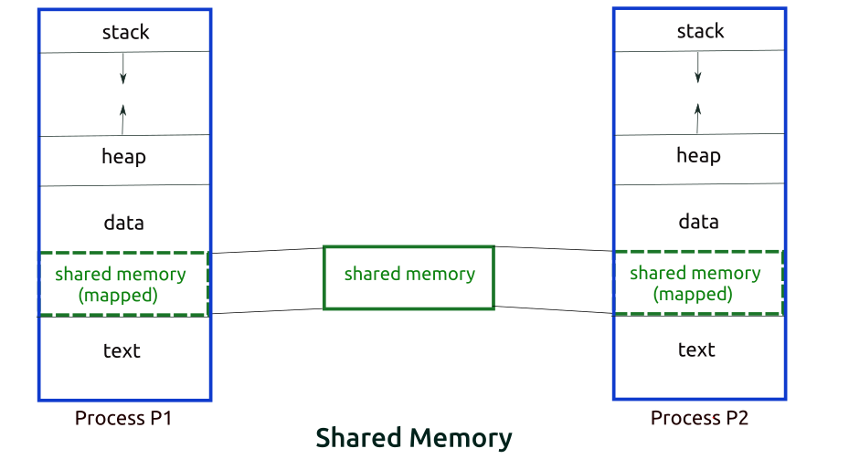

# IPC

날짜: 2023년 3월 29일
태그: 운영체제

### 1️⃣ IPC (Inter-Process-Communication)

프로세스는 독립적으로 실행된다. 즉, 프로세스는 다른 프로세스에 영향을 주지 않는다는 것이다.

그런데 이런 프로세스 간의  통신이 필요할 때가 있다. 이를 가능하도록 하는 것이 IPC 통신이다.

프로세스는 `커널`이 제공하는 IPC 설비를 이용해 프로세스간 통신을 하게 된다

### 2️⃣ IPC의 종류

IPC는 크게 두 가지 종류로 나뉜다. `공유 메모리(Shared Memory)` 와 `메시지 전달(Message Passing)` 모델이다.

### `공유 메모리 모델`



두 개 이상의 프로세스들이 주소 일부의 공간을 공유하며 공유한 메모리 영역에 Read & Write 를 통해 통신을 수행한다

프로세스가 공유 메모리 할당을 커널에 요청하면, 커널은 해당 프로세스에 메모리 공간을 할당해 주게 되고, 이후 어떤 프로세스건 해당 메모리 영역에 접근할 수 있다

공유 메모리가 설정되면 그 이후의 통신은 커널의 관여 없이 진행이 가능하다

### `공유 메모리 모델`의 장점

- 커널의 관여 없이 메모리를 직접 사용하여 IPC 속도가 빠르다
- 프로그램 레벨에서 통신 기능을 제공하며, 자유로운 통신이 가능하다

### `공유 메모리 모델`의 단점

- 메시지 전달 방식이 아니기에, 데이터를 읽어야 하는 시점을 알 수 없다
    - 프로세스 A가 공유 메모리에 데이터를 전달해도, 프로세스 B는 그것을 알 수 없다
- 이를 해결하기 위해 별도의 동기화 기술이 필요하다
- 동시에 같은 메모리 위치를 접근하는 문제가 발생할 수 있다. 그래서 공유 메모리에 접근할 프로세스 간의 Lock 메커니즘이 필요하다.

### `메시지 전달 모델`


### `메시지 전달 모델`의 특징

- 커널 메모리 영역에 메시지 전달을 위한 채널을 만들어서 협력하는 프로세스들 사이에 메시지 형태로 정보를 Send, Receive 하는 방법이다.
- 커널을 경유하여 메시지를 송/수신자끼리 주고 바등며 커널에서는 데이터를 버퍼링한다
- A 프로세스가 커널로 메시지를 보내면, 커널이 B에게 메시지를 보내 준다.
- 프로세스 간 메모리 공유 없이 동작이 가능하다.

### `메시지 전달 모델의` 장점

- 커널에서 데이터의 주고 받는 것을 컨트롤할 수 있어 별도의 동기화 로직이 없어도 된다

### `메시지 전달 모델`의 단점

- 커널을 통해 데이터를 주고받기 때문에 `공유 메모리 모델`보다 느리다.

### `메시지 전달 모델` 의 종류

1. Direct Communication
    1. 통신하려는 프로세스의 이름을 명시적으로 표시하여 메시지 직접 전달
2. Indirect Communication
    1. mailbox 나 port 를 통해 메시지를 간접 전달.

### 3️⃣ `커널`?

- `운영체제의 핵심적인 부분`으로, 다른 모든 부분에 여러 기본적인 서비스를 제공해줌
- 운영체제가 설치된 모든 커널에는 커널이 존재함. 어떤 커널을 사용하는지에 따라 프로그램이 하드웨어를 이용하는 성능이 달라짐
- 사용자 인터페이스(GUI, CLI)는 컴퓨터와 상호작용하기 위한 통로일 뿐, 커널에 속한 기능이 아님

### 4️⃣ `커널`의 이중 모드와 시스템 호출

운영체제는 사용자가 실행하는 응용 프로그램이 하드웨어 자원에 직접 접근하는 것을 방지하여 자원을 보호합니다. 응용 프로그램이 `자원`(cpu, 메모리, 하드) 등에 마음대로 접근하고 조작할 수 있다면 컴퓨터 전체에 큰 악영향을 끼칠 수 있다!

그래서 **운영체제는 오직 자신을 통해서만** `자원`**에 접근**하게 합니다.


> 프로그램이 하드 디스크에 접근하려면 운영체제에 도움을 요청해서, 운영체제게 커널 영역 내의 하드 디스크에 데이터를 저장하는 코드를 실행하여 응용 프로그램의 작업을 대신해 준다.
> 

### 5️⃣ `커널`의 이중 모드

cpu가 명령어를 실행하는 모드를 사용자 모드와 커널 모드로 구분하는 방식

`사용자 모드` 

- 운영체제 서비스를 제공받을 수 없는 실행 모드
- 커널 영역의 코드를 실행할 수 없음
- 일반적인 응용 프로그램은 기본적으로 사용자 모드

`커널 모드`

- 운영체제 서비스를 제공받을 수 있는 실행 모드

CPU가 `사용자 모드`로 실행 중인지, `커널 모드`로 실행 중인지는 플래그 레지스터 속 슈퍼바이저 플래그를 보면 알 수 있습니다. 플래그가 1일 경우 `커널 모드`로 실행 중이고, 0일 경우 `사용자 모드`로 실행 중입니다.

`**플래그 레지스터**` @ CPU 내부 기구 중 하나로, 산술 연산 상태를 보여주는 flag bit들이 모인 레지스터. 산술 연산시 CPU에 따라 자동적으로 세팅되며 프로세서의 현재 상태를 결정한다

`부호 플래그` 연산한 결과의 부호를 나타낸다

`제로 플래그` 연산 결과가 0인지 아닌지 여부를 나타낸다

`캐리 플래그` 연산 결과가 비트 범위를 넘어간 여부를 나타낸다

`오버플로우 플래그` 부호 있는 숫자의 연산 결과가 비트 범위를 넘어섰을 때 참이 된다

`인터럽트 플래그` 이 플래그가 참일 때 인터럽트 요구를 받아들인다

`**수퍼바이저 플래그**` 운영체제 모드와 사용자 모드 중 어떤 프로그램을 실행 중인가를 나타낸다


### 사용자 모드 프로그램이 `커널` 모드 서비스를 제공받으려면

운영체제에 요청을 보내 커널 모드로 전환해야 합니다. 이 때 운영체제 서비스를 제공받기 위한 요청을 **System Call** 이라 합니다.


### 6️⃣ 시스템 호출

- 시스템 호출은 인터럽트를 발생시키는 특정 명령어에 대해 발생하는 소프트웨어 인터럽트
    1. 시스템 호출 발생시키는 명령어가 실행됨
    2. cpu는 지금까지의 작업을 백업함
    3. 커널 영역 내에 시스템 호출을 수행하는 코드를 실행함
    4. 다시 기존에 실행하던 응용 프로그램으로 복귀하여 실행을 계속해 나감


**일반적으로 응용 프로그램은 실행 과정에서 운영체제 서비스들을 매우 빈번하게 이용함. 그 과정에서 빈번하게 시스템 호출을 발생시키고, 사용자 모드와 커널 모드를 오감**

### 7️⃣ 다시, IPC

프로세스가 통신 가능하다는 것은 서로 다른 프로세스 가 데이터를 주고 받을 수 있다는 건데, 그 때 필요한 것이 동시에 접근가능한 메모리. 즉 `프로세스들이 공유하는 메모리`가 필요하다.

그런데 프로세스는 생성되면서 `PC` 를 포함하여 메모리 공간 등을 복사하여 자원을 할당한다

`pc` 현재 실행 중인 명령어의 주소

그래서 프로세스간 통신을 위해서는 별도의 메모리 공간을 할당해주어야 한다. 

### 8️⃣ IPC 종류 6가지

1. `익명 파이프(PIPE)` / 메시지 전달 모델
    - 두 개의 프로세스를 연결하는 기술. 하나의 프로세스는 데이터를 쓰기만 하고 다른 하나는 데이터를 읽기만 할 수 있다.
    - 한 쪽 방향으로만 통신이 가능한 반이중 통신.
    - 하지만 양쪽으로 송수신을 하려면 파이프를 2개 만들어야 하는데 이는 매우 복잡하다.
    - 통신할 프로세스를 정확히 아는 경우에 사용
    - 단수의 프로세스간 메시지 전달 가능
2. `Named PIPE(FIFO)` / 메시지 전달 모델
    - 전혀 모르는 상태의 프로세스들 사이 통신에 사용한다
    - 부모 프로세스와 무관한 다른 프로세스도 통신이 가능
    - 이 또한 양쪽으로 송수신을 하려면 파이프를 2개 만들어야 하는데 이는 매우 복잡하다.
    - 단수의 프로세스간 메시지 전달 가능
3. `Message Queue` / 메시지 전달 모델
    - 입출력 방식은 Named 파이프와 동일함
    - 데이터의 흐름이 아닌 메모리 공간
    - 사용할 데이터에 번호를 붙이면서 여러 프로세스가 동시에 데이터를 쉽게 다룰 수 있음
    - 다수의 프로세스간 메시지 전달 가능
4. `공유 메모리` / 공유 메모리 모델
    - 파이프, 큐가 통신을 이용한 설비라면 공유 메모리는 데이터 자체를 지원하도록 지원하는 설비
    - 프로세스간 메모리 영역을 공유해서 사용할 수 있도록 허용해준다.
    - 프로세스가 고유 메모리 할당을 커널에 요청하면, 커널은 해당 프로세스에 메모리 공간을 할당해주고, 이후 모든 프로세스는 그 메모리 영역에 접근할 수 있게 된다.
    - 중개자 없이 메모리에 접근할 수 있어서 IPC중 가장 빠르다
5. `메모리 맵` 
    - 공유 메모리처럼 메모리에 공유해준다. 메모리 맵은 열린 파일을 메모리에 맵핑시켜서 공유하는 방식이다.
    - 파일로 대용량 데이터를 공유해야 할 때 사용한다.
6. `소켓` / 메시지 전달 모델
    - 네트워크 소켓 통신을 통해 데이터를 공유한다
    - 클라이언트와 서버가 소켓을 통해서 통신하는 구조로, 원격에서 프로세스 간 데이터를 공유할 때 사용한다.


### 9️⃣ `Stream` VS `구조체`

`Stream` 은 입력이나 출력이 표현된 바이트의 흐름이다. 이는 운영체제에 의해 생성되는 가상의 연결 고리이며, 중간 매개자 역할이다.


스트림은 한 방향으로만 생성될 수 있으므로, 입력과 출력을 동시에 처리할 수는 없다. 

`IPC 구조체`는 여러 객체를 하나로 모아놓은 것이다. IPC 공통 구조체는 다음과 같은 구조를 가진다

```java
struct ipc_perm {
    uid_t uid;
    gid_t gid;
    uid_t cuid;
    gid_t cgid;
    mode_t mode;
    uint_t seq;
    key_t key;
    int pad[4];
};
```

### 🙏🏻 출처

[https://hongong.hanbit.co.kr/운영체제란-커널의-개념-응용-프로그램-실행을-위한/](https://hongong.hanbit.co.kr/%EC%9A%B4%EC%98%81%EC%B2%B4%EC%A0%9C%EB%9E%80-%EC%BB%A4%EB%84%90%EC%9D%98-%EA%B0%9C%EB%85%90-%EC%9D%91%EC%9A%A9-%ED%94%84%EB%A1%9C%EA%B7%B8%EB%9E%A8-%EC%8B%A4%ED%96%89%EC%9D%84-%EC%9C%84%ED%95%9C/)

[https://steady-coding.tistory.com/508](https://steady-coding.tistory.com/508)

[https://dar0m.tistory.com/233](https://dar0m.tistory.com/233)