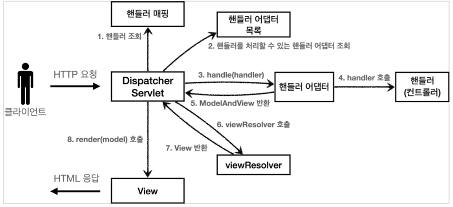

# Weekly CS면접질문정리-1

날짜: 2023년 4월 10일
태그: 면접질문

### **[알고리즘] 버블정렬 과정과 특징 설명해주세요.**

버블 정렬은 서로 인접한 두 원소의 대소를 비교하고 조건에 맞지 않다면 자리를 교환하여 정렬하는 알고리즘입니다.

시간복잡도는 모두 O(n^2)로 동일하며 공간복잡도는 주어진 배열 안에서 교환을 통해 정렬이 수행되므로 O(n)

### **[네트워크] REST API란 무엇인가요?**

HTTP URI를 통해 어떤 자원인지 명시하고 HTTP Method를 통해 해당 자원을 처리하도록 설계된 API입니다. 6가지 원칙을 따릅니다

`계층화` 

클라이언트는 REST API Server 만 호출한다. 

REST server 는 다중 계층으로 구성될 수 있다. API서버는 순수 비즈니스 로직을 수행하고 그 앞단에 보안, 로드밸런싱, 암화화 등을 추가하여 구조상의 유연성을 줄 수 있다.

`인터페이스 일관성` ⭐

URI로 지정한 리소스에 대한 조작을 통일되고 한정적인 인터페이스로 수행한다

HTTP 표준 프로토콜에 따르는 모든 플랫폼에서 사용이 가능하다

`무상태`

HTTP 프로토콜이 무상태성이므로 REST 역시 무상태성이다

클라이언트의 세션과 쿠키같은 context 정보를 서버에 저장하지 않는다

서버는 각각의 요청을 완전히 별개의 것으로 인식하고 처리한다

`클라이언트-서버 구조`

자원이 있는 쪽이 서버, 자원을 요청하는 쪽이 클라이언트

`Code on Demand`

필수 아님!

서버로부터 스크립트를 받아서 클라이언트에서 실행한다.

`캐시 처리 기능`

웹 표준 HTTP 프로토콜을 그대로 사용하므로 웹에서 사용하는 기존의 인프라를 그대로 활용할 수 있다.

> 개인무클코캐!
> 

### **[네트워크] HTTP methods에 대해 설명해주세요.**

HTTP 메소드는 서버가 수행해야 할 동작을 지정해서 요청을 보내는 방법입니다.

`GET` 리소스 조회

`POST` 요청 데이터 처리. 주로 등록에 사용

`PUT` 리소스 덮어쓰기, 리소스 없으면 생성

`DELETE` 리소스 삭제

### **[자바] 자바의 call by value에 대해 설명해주세요.**

call by value 는 값을 복사해서 넘겨주는 방식입니다. 그래서 call by value 로 넘어간 변수는 서로 다른 변수입니다.

자바의 파라미터 전달 방법은  call by value 로 동작합니다. 

`원시 타입` stack 영역에 변수와 함께 저장

`참조 타입` 객체는 heap 영역에 저장되고 stack 영역에 있는 변수가 객체의 주소값을 가지고 있음

### **[DB] SQL과 NoSQL 차이에 대해 설명해주세요.**

`SQL` 

- 정해진 데이터 스키마에 따라 테이블에 저장, 관계를 통해 여러 테이블에 분산
- 수직적 확장(서버성능향상)만 지원
- 데이터가 중복없이 한번만 저장

`NoSQL` 

- 스키마도 없고 관계도 없음
- 수직,수평(데이터베이스 분산) 확장 둘다 지원
- 데이터가 여러 컬렉션에 중복되어 있을 수 있음

관계를 맺고 있는 데이터가 자주 변경되며 명확한 스키마가 사용자와 데이터에게 중요한 경우는 SQL

정확한 데이터 구조를 알 수 없고, 읽기를 자주 하지만 데이터 변경은 자주 없는 경우 NoSQL사용이 유리합니다.

하지만 

SQL을 선택해서 복잡한 JOIN문을 만들지 않도록 설계하여 단점을 없앨 수도 있고

NoSQL을 선택해서 중복 데이터를 줄이는 방법으로 설계해서 단점을 없앨 수도 있습니다.

### **[DB] 트랜잭션에 대해 설명해주세요.**

데이터베이스 트랜잭션은 데이터베이스의 작업 단위입니다.

`원자성` 한 트랜잭션은 성공하거나 실패해야 한다

`일관성` 트랜잭션의 작업 처리가 항상 일관성이 있어야 한다

트랜잭션 진행도중에 데이터베이스가 변경되더라도 업데이트된 데이터베이스로 트랜잭션이 진행되는 것이 아니라, 처음에 트랜잭션을 진행하기 위해 참조한 데이터베이스로 진행되어야 한다.

`고립성` 각 트랜잭션은 서로에게 영향을 줘서는 안 된다

`지속가능성` 트랜잭션이 성공적으로 완료되었으면 결과는 영구적으로 반영되어야 한다

네 가지의 특징을 가집니다.

### **[운영체제] 데드락에 대해 설명해주세요.**

데드락이란 두 개 이상의 작업이 서로 상대방의 작업이 끝나기만을 기다리면서 아무것도 완료되지 못하는 상태를 가리킵니다.

데드락에는 네 가지 조건이 있는데, 이 네 가지 조건을 모두 만족해야 데드락이 발생합니다.

`상호 대기` 한 프로세스가 사용 하는 자원을 다른 프로세스가 사용할 수 없는 상태

`점유과 대기` 자원을 할당받은 상태에서 다른 자원을 기다리는 상태

`비선점` 어떤 프로세스보다도 다른 프로세스의 자원을 강제로 빼앗지 못하는 상태

`원형 대기` 프로세스들이 원의 형태로 자원을 대기하는 상태

상점원비

데드락의 해결방법으로는 

`**예방**` 

    `상호배제` 현실적으로 불가능

    `점유대기` 자원활용률 너무 떨어짐

    `비선점조건없애기` 모든자원이 선점가능하지 않음

    `원형대기조건` 모든 자원에 번호붙이고 오름차순으로 하면 되지만 어려움

`**회피**` 조심조심 사용. 안전 순서열 만들어서 사용함

    `검출 후 회복` 

    `선점을 통한 회복` 교착 상태가 해결될 때까지 한 프로세스씩 자원을 몰아주기

    `프로세스 강제 종료를 통한 회복` 강제종료하고 자원을 다른데 주는 과정에서 오버헤드 발생

`**무시**`

 등이 있습니다.

### **[네트워크] TCP와 UDP의 차이를 설명해주세요.**

TCP는 연결 지향적이고 UDP는 연결되어있지 않습니다.

TCP는 핸드쉐이킹을 통해 연결하기 때문에 정보의 신뢰성이 있습니다.

하지만 UDP는 핸드쉐이킹 과정이 없기 때문에 좀더 빠르지만 중간에 정보가 몇 개 더 빠지거나 할 수 있습니다.

그래서 TCP 는 텍스트 문서 송수신 등에 쓰이고 UDP는 스트리밍 서비스에 쓰입니다.

### 1**0. [자료구조] List, Set, Map의 차이에 대해 설명해주세요.**

List는 순서가 있고, 배열크기가 자동으로 늘어납니다. 그리고 인덱스 접근이 가능합니다

Set은 데이터의 집합이며 중복된 데이터를 허용하지 않습니다. 빠른 검색 속도를 가집니다.

Map은 키밸류쌍으로 이루어져있고 뛰어난 검색 속도를 가집니다. key 중복이 없으며 순서를 보장하지 않습니다.

### **[JAVA] 자바8 에서 stream을 사용해 보셨나요?**

스트림은 컬렉션,배열 등에 저장된 요소들을 하나씩 참조하면서 코드를 실행할 수 있는 기능입니다. 람다식을 사용할 수 있어서 코드를 직관적으로 처리할 수 있습니다.

```java
데이터.Stream생성().중개연산()...종료연산; 구조로 사용됩니다.
```

### **[네트워크] 상태 코드에 대해 아는 대로 말해보세요**

모든 HTTP응답 코드는 5개로 분류할 수 있습니다.

100번대는 응답을 받았고, 처리 중에 있다는 응답

200번대는 요청을 성공적으로 받았다는 응답

300번대는 응답 완료를 위해 추가 동작이 필요하다는 응답

400번대는 클라이언트의 잘못된 요청

500번대는 클라이언트의 요청은 정상적이지만 서버의문제로 응답이 불가능한 경우

그 중 중요한 몇 가지를 말하자면

200번대는 요청 정상 처리, 204는 요청 정상 처리하였지만 돌려줄 리소스가 없는 경우, 400은 클라이언트의 요청 구문이 잘못되었다는 뜻(단, 클라이언트는 이를 200과 같은 형태로 취급), 401은 http 인증이 필요하다는 뜻, 403은 권한이 없다는 뜻, 404는 클라이언트가 요청한 리소스가 서버에 없다는 뜻, 405는 허용되지 않은 http메서드를 사용했다는 뜻, 500번은 서버에서 처리 중 에러가 발생했다는 뜻입니다.

### **❓ [DB] 인덱스가 CRUD를 수행할 때 어떻게 동작하는지**

`create` 컬럼 추가시 인덱스도 추가됩니다.

`read` 컬럼 조회시 인덱스로 검색하기 때문에 검색 속도가 더 빨라집니다.

`update` 컬럼을 업데이트하면 해당 컬럼을 사용하는 인덱스는 재생성됩니다. 이 작업도 오버헤드가 큽니다. 그래서 대규모의 테이블에서는 컬럼 업데이트시 인덱스를 일시적으로 비활성화시키기도 합니다.

`delete` 컬럼을 삭제하면 해당 컬럼이 사용된 인덱스도 함께 삭제됩니다. 이 작업은 오버헤드가 큽니다

### **[스프링] DI 에 대해서 아는 대로 설명해 주세요**

객체가 의존하는 또다른 객체를 외부에서 선언하고 주입하면 결합도가 느슨해집니다.

스프링의 DI에는 세 가지 방법이 있습니다. 

`생성자 주입 방식` 가장 권장되는 방식이며, 생성자의 호출 시점에 1회만 호출되는 것이 보장됩니다

`setter 주입 방식` 주입받는 객체가 변경될 가능성이 있을 때 사용합니다

`필드 주입 방식` 외부에서 접근이 불가

### **[운영체제] 멀티 프로세스 대신 멀티 쓰레드를 사용하는 이유**

오버헤드가 줄어들기 때문입니다. 프로세스를 생성하고 자원을 할당하는 시스템 콜이 줄어들기 때문에 자원을 더 효율적으로 관리 할 수 있습니다.

### **[스프링] 디스패처 서블릿(Dispatcher Servlet)에 대해 설명해주세요**

디스패처 서블릿이란 http프로토콜을 통해 들어오는 모든 요청을 먼저 받아 적합한 컨트롤러에 위임해주는 프론트 컨트롤러.



1. 클라이언트에서 요청이 오면 디스패처 서블릿이 해당 요청을 받는다
2. 핸들러 맵핑을 통해 요청에 알맞은 컨트롤러를 찾아낸다
3. 찾아낸 컨트롤러를 핸들러 어댑터를 통해 해당 컨트롤러의 메서드를 실행시킨다
4. 컨트롤러는 요청 결과와 뷰 정보를 디스패처 서블릿에 전달한다.
5. 뷰 리졸버를 통해 뷰 파일을 찾는다

### **[스프링] DAO, DTO, VO에 대해 설명해주세요**

`DAO` 실제 DB의 데이터에 접근하기 위한 객체(repository package)

`DTO` 로직을 가지지 않은 순수한 데이터 객체

`VO` getter 만 가지고 있음. read only 오브젝트 ( 두 객체의 모든 필드 값이 동일하면 두 객체는 같다)

### [자바] **객체와 클래스의 차이는 무엇인가요?**

객체는 청사진이고 클래스는 청사진으로 찍어낸 인스턴스를 의미합니다.

### **[자바] jvm의 메모리 구조에 대해 설명해주세요**

`가비지 컬렉터` 참조되지 않은 객체들을 탐색해서 제거

`Execution Engine` 클래스 로더를 통해 Runtime Data Area에 배치된 바이트 코드를 명령어 단위로 읽어서 실행함. 인터프리터 방식으로 코드를 읽다가 일정한 기준이 넘어가면 JIT 컴파일러 방식으로 실행함

`클래스 로더` 자바 컴파일러가 변환한 바이트 코드 클래스 파일을 로드하는 역할

`런타임 데이터 공간` 사용되는 데이터들을 적재하는 영역

JVM의 메모리 구조는 클래스 영역, 스택 영역, 힙 영역으로 나누어져 있습니다.

`클래스 영역` static 변수나 멤버 변수, 상수, 메소드 등이 저장됩니다.

`스택 영역`에는 메소드 내에서 정의하는 기본 자료형에 해당하는 지역변수의 데이터 값이 저장

`힙 영역`에는 동적 값이 존재합니다. 스택의 변수 등이 힙영역의 주소를 가르키고 있기도 합니다.

`PC레지스터` 현재 수정중인 JVM명령의 주소를 가짐

`네이티브 메소드 스택` 자바 외 언어로 작성도니 네이티브 코드를 위한 메모리 영역

### **[네트워크] 쿠키(Cookie)와 세션(Session)의 차이점에 대해 말해주세요.**

쿠키는 서버의 자원을 전혀 사용하지 않지만 세션은 서버의 자원을 사용합니다

쿠키는 브라우저를 종료해도 정보가 남아 있지만 세션은 사라집니다

쿠키가 더 빠르고 세션이 더 느립니다

사실 세션은 쿠키를 사용합니다.

세션 아이디를 발급받고, 클라이언트는 세션 아이디에 대한 쿠키를 저장해서 가지고 있다가 이 아이디로 서버로부터 세션을 전달받음

### **[네트워크] JWT 토큰에 대해 설명해주세요.**

Json Web Token 의 줄임말입니다. 암호화를 통해 안전하게 정보를 주고 받는 데 사용됩니다.

헤더, 페이로드, 시그니처입니다.

헤더는 알고리즘과 토큰

페이로드는 데이터

시그니처는 시그니처 해시값, 헤더와 페이로드를 알고리즘으로 해싱한값이 들어가 있습니다.

### **[네트워크] 로드밸런싱(Load Balancing)에 대해 설명해주세요.**

로드밸런싱은 부하 분산이라고 말할 수 있습니다. 갑작스럽게 트래픽이 증가했을 때 로드밸런싱을 통해 해결할 수 있습니다.

`scale up` 서버 자체의 성능을 높이는 것

`scale out` 여러 대의 서버를 두어서 로드 밸런싱으로 트래픽을 균등하게 분산해줌

`L4로드밸런싱`  4계층에서 로드 밸런싱. 데이터의 안을 안 보고 패킷 레벨에서만 분산하기 때문에 속도가 빠르고 효율이 높음

`L7로드밸런싱` 7계층에서 로드 밸런싱. 헤더나 쿠기같은 사용자 요처을 기준으로 특정 서버에 트래픽 분산 가능. 섬세한 라우팅이 가능하고 더 많은 비용 소모

### **[네트워크] www.naver.com에 접속할 때 새기는 과정에 대해 설명해주세요.(웹 동작 방식)**

1. 사용자가 입력한 주소 중에서 도메인 네임 부분을 DNS서버에서 검색하고, DNS 서버에서 해당 도메인 네임에 해당하는 IP주소를 찾아 입력한 URL 정보와 함께 전달한다
2. URL 정보와 전달받은 IP 주소는 HTTP 프로토콜을 사용하여 HTTP 요청 메세지를 생성하고, TCP 프로토콜을 ㅌ사용하여 해당 IP주소의 컴퓨터로 전송된다
3. HTTP 요청 메세지는 HTTP 프로토콜을 사용하여 URL 정보로 변환되어 웹 페이지 URL 정보에 해당하는 데이터를 검색한다
4. 검색된 데이터는 HTTP 응답 메세지를 생성하고 TCP 프로토콜을 사용하여 인터넷을 거쳐 원래 컴퓨터로 전송된다
5. HTTP 응답 메세지는 웹 페이지 데이터로 변환되어 웹 브라우저에 의해 출력되어 사용자가 볼 수 있게 된다.


### **[운영체제] 뮤텍스와 세마포어의 차이점에 대해 말해주세요.**

뮤텍스는 이진 세마포어라고도 불립니다. 뮤텍스는 동기화 대상이 오직 하나일 때 사용하며 세마포어는 1개 이상일 때 사용합니다. 

뮤텍스는 자원을 소유할 수 있는 반면 세마포어는 자원 소유가 불가능합니다

뮤텍스는 상태가 0,1뿐이므로 lock 을 가질 수 있고, 소유한 스레드만이 이 뮤텍스를 해제할 수 있지만 세마포어는 세마포어를 소유하지 않는 스레드가 세마포어를 해제할 수 있습니다.


### **[운영체제] 페이지 교체 알고리즘에 대해 설명해주세요.**

필요한 페이지가 메모리에 없을 때 page-falut 가 발생하고, backing store 에서 해당 페이지를 찾아 빈 프레임에 로딩해야 하는데, 빈 프레임이 없을 경우에 희생당할 프로엠을 고르는 알고리즘입니다.

fifo는 가장 먼저 메모리에 올라온 페이지를 가장 먼저 내보내는 알고리즘이고

opt 가장 오랫동안 사용하지 않을 페이지 교체 ( 실제구현 힘듬)

LRU 가장 오랫동안 사용하지 않은 페이지를 교체 (많은 운영체제 채택)

LFU 참조횟수가 가장 적은 페이지 교체

MFU 참조 횟수가 가장 많은 페이지 교체

### [스프링] JPA N+1 문제와 발생하는 이유, 해결방법에 대해 설명해주세요.

n+1이란 한 번의 쿼리를 날렸을 때 의도하지 않은 N번의 쿼리가 추가적으로 실행되는 것을 의미합니다.

연관관계를 가진 엔티티를 조회할 때 한 쪽 테이블만 조회하고 연결된 다른 테이블을 따로 조회하기 때문인데, 패치조인을 사용하면 미리 두 테이블을 조인하여 한 번에 모든 데이터를 가져오기 때문에 N+1 문제를 막을 수 있습니다.

