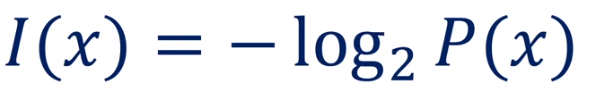

# 1️⃣ [운영체제 1] 운영체제란?

날짜: 2023년 3월 31일
태그: 운영체제

### 2️⃣ 운영체제란?

컴퓨터를 관리하는 SW

### 3️⃣ 컴퓨터란?

정보를 처리하는 기계

### 4️⃣ 정보란?

클로드섀넌이 정의하기를, 불확실한 상황을 처리해서 수치적으로 표현한 것을 정보라고 한다.

### 5️⃣ 컴퓨터가 정보를 어떻게 처리하죠?

`정보의 최소 단위` : bit(binary digit)

`정보의 처리` : 정보의 상태 변환

`부울 대수` : NOT, AND, OR ←이것들은 트랜지스터로 만듭니다.

`논리 게이트` : NOT, AND, OR, XOR, NAND, NOR

`논리 회로` : IC, LSI, VLSI, ULS, SOC

`정보의 저장` : 플립-플롭

`정보의 전송` : 데이터 버스

`덧셈은?` 반가산기(AND, OR), 전가산기(반가산기를 병렬로 연결)

`뺄셈은?` 2의 보수 표현법

`곱셈과 나눗셈은?` 덧셈과 뺄샘의 반복

`실수 연산은?` 부동 소수점

`함수는?` goto

`삼각함수는?` `미분은?` `적분은?` `사진 촬영은?` 다 가능!

### 6️⃣ 그럼 컴퓨터는 만능(universality)인가요?

만능은 아니지만, 범용성이 있습니다.

NOT, AND, OR 게이트만으로 모든 계산을 할 수 있습니다

혹은 NAND 게이트만으로 모든 계산을 다 할 수 있습니다.

이를 범용 컴퓨터(general-purpose computer)라고 부릅니다.

### 7️⃣ 계산 가능성 : compuability

Turin-computable : 튜링 머신으로 계산가능한거

Halting Problem : 튜린 머신으로 계산 불가능한 거

### 8️⃣ 앨런 튜링은 뭘 했나요?

현대 컴퓨터의 구조인 CPU, RAM, Application Programs, Operating System 의 기초를 만들었습니다

### 9️⃣ 폰 노이만은 뭘 했나요?

내장형 프로그램 방식을 처음 도입했습니다. 프로그램을 램에 저장하는 것을 의미합니다.

SW를 램에 저장하고 CPU가 하나씩 fetch 해서 excute하는 걸 fetch-execute 사이클이라고 합니다. 이 사이클을 만들었습니다.

폰 노이만 아키텍처(ISA)

### 🔟 프로그램은 뭔가요?

명령어들의 집합

기계어를 어셈블리어로 읽을 수 있게 표현한 것이 명령어입니다.

### 1️⃣1️⃣ 그럼 운영체제도 프로그램인가요?

- 프로그램인데, 컴퓨터에서 항상 실행되는 프로그램입니다.
- 시스템 서비스를 애플리케이션 프로그램에 전해줍니다.
- 프로세스를 관리하고, 리소스(파일), 유저 인터페이스(마우스,키보드 등) 등등을 관리합니다.

### 1️⃣2️⃣ 그럼 다시, 운영체제가 뭔가요?

컴퓨터 시스템을 소프트웨어적으로 운영하는 것.

HW 디바이스를 제어하고, APP들이 하드웨어 서비스를 받을 수 있게 하고, 유저가 I/O를 하게 해 주는 것

아두이노나 라즈베리파이는 하드웨어를 직접 제어했지만, 컴퓨터는 시스템이 복잡해지면서 운영체제가 이를 관리하는 겁니다.

### 1️⃣3️⃣ 다음 중 컴퓨터가 아닌 것은?

휴대폰, 텔레비전, 자동차, 지갑:

→ 다 운영체제

### 1️⃣4️⃣ 다음 중 운영체제가 필요없는 것은?

휴대폰, 텔레비전, 자동차, 지갑

지갑 또한 nfc 칩이 존재하고, 이를 제어하는 OS 가 있습니다.

즉, 현대사회에서 컴퓨터가 아닌 것은 별로 없다는 겁니다.