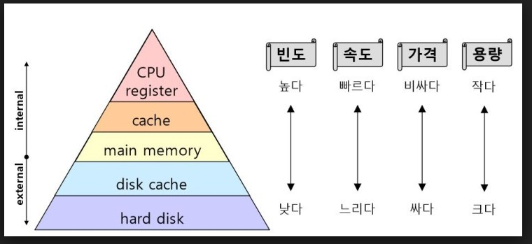

# [운영체제 2] 운영체제의 개념과 구조

### 1️⃣ 커널

OS 의 핵심 부분을 담당한다. 그래서 우리는 커널의 중요한 부분만 배울 것이다

### 2️⃣ 전통적인 컴퓨터 시스템

- cpu
- 여러개의 디바이스 컨트롤러와 bus

### 3️⃣ 부트스트랩 프로그램

HDD 에 있는 OS 를 메모리에 로딩하는 프로그램

> 전원을 켰을 때 cpu연결된 메모리에는 아무 것도 없다. cpu가 제일 처음 연결해야 할 명령어가 있어야 할 것이다. 그걸 부트스트랩 프로그램이라 한다.
> 

### 4️⃣인터럽트

cpu 가 있고, 메모리가 있을 때 또다른 시작해야할 행위를 cpu에게 알려주는 것.

하드웨어가 인터럽트를 트리거시킴 → cpu에 시그널 → 시스템 버스를 통해서 시그널을 전달해줌

### 5️⃣ 저장 장치

계층 구조

- 용량/속도에 따라 (비례)

(레지스터 - 캐시메모리(비쌈)-램(메모리)-SSD(메모리형태의HD)- 하드디스크-광학 디스크 - 마그네틱 테이프)

[https://jobdong7757.tistory.com/17](https://jobdong7757.tistory.com/17)

### 6️⃣ SMP(멀티 프로세서)

cpu 하나에 메모리 하나의 구조는 초소형 임베디드 시스템이 아니면 사용하지 않는다. 그래서 요즘은 SMP(cpu가 여러개) 구조를 가진다. 

메모리가 하나고, cpu가 여러개인 형태이다. 슈퍼컴퓨터같은 경우 cpu가 수백만개 붙어 있다.

### 7️⃣ 멀티코어

cpu를 너무 많이 달면 비용이 많이 드니까, cpu 안의 코어(레지스터,캐시)만 따로 회로를 구성하면 어떨까? 

4코어, 8코어 등의 얘기가 나오는게 이 멀티코어 이야기다.

### 8️⃣ 멀티 프로그래밍

옛날엔  job을 한 개만 로딩해서 썼다. 그런데 여러 개의 프로그램을 동시에 메모리에 올리고 동시에 실행시킬 수는 없을까? 그게 멀티 프로그래밍이다.

### 9️⃣ 메모리에 프로세스가 동시에 올라가 있으면 뭐가 좋나요?

cpu효율을 높일 수 있습니다. 

### 🔟 Multitasking(multiprocessing)

- cpu가 노는 시간을 활용할 수 있습니다
- cpu시분할을 하게 되면 여러 개의 프로세스를 자주 바꿔주면서 돌릴 수 있습니다.

### 1️⃣1️⃣ cpu 스케줄링

cpu 효율을 제일 좋게 만드는. 다음 실행시킬 프로세스를 고르는 것

### 1️⃣2️⃣ 유저 모드와 커널 모드

초보 프로그래머가 바로 컴퓨터 자원에 접근하면 큰일날 것이다. 그래서 `System call` 을 통해 직접적으로 자원을 건드리는 일들을 커널에 맡긴다.

### 1️⃣3️⃣가상화

하드웨어 자원에서도 운영체제를 여러 개 돌릴 수 있지 않을까? 이를 `VMM(가상화 머신 매니저)` 가 가능하게 한다. CPU 스케줄링을 하듯이 OS를 스케줄링 하는 것이다

### 1️⃣4️⃣다양한 컴퓨팅 환경

- Traditional Computing(전통적인 컴퓨팅)
- Mobile Computing
- Client-Server Computing(클라이언트-서버 응답)

- Peer-to-Peer Computing(토렌트)

- Cloud Computing(edge Computiong)

- Real-Time Embedded Systems(AWS)
- Real-Time Embedded Systems(화성탐사)

### 1️⃣5️⃣OS 가 하는 일

- 유저 인터페이스
- 프로그램 실행
- IO
- 파일 시스템 관리
- 통신
- 에러 디텍션
- 자원 배분
- 로깅
- 보안

### 1️⃣6️⃣ 시스템 콜

- 사용자가 interface 하는 방법
    - CLI(command line interface) : 명령어
    - GUI(graphical user interface):
    - Touch Screen Inteerface
- 프로그램이 OS 와 interface 하는 법
    - System Call

API : application programming interface 

OS 의 API가 `System call`!

하지만 항상 System call을 하는 과정을 하는 것은 복잡하다. 그래서 라이브러리를 사용한다.

하지만 대표적인 명령어는 알고 있으면 좋다.

출처

---

[https://jobdong7757.tistory.com/17](https://jobdong7757.tistory.com/17)

[https://www.youtube.com/watch?v=fn2bUK_jL6U&list=PLHqxB9kMLLaOs2BM2KbuvttBYCgDoFm-5&index=2](https://www.youtube.com/watch?v=fn2bUK_jL6U&list=PLHqxB9kMLLaOs2BM2KbuvttBYCgDoFm-5&index=2)