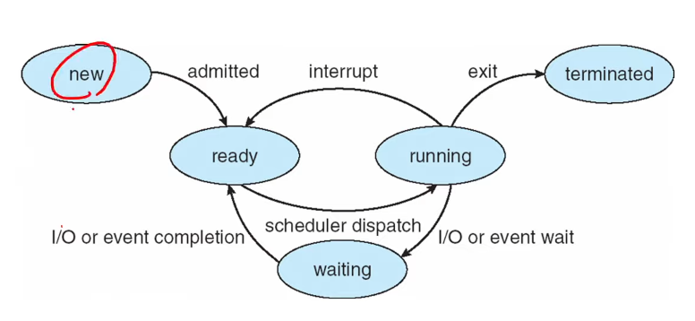

# [운영체제 3] 프로세스의 이해

날짜: 2023년 4월 4일
태그: 운영체제

### 1️⃣ 프로세스

실행 중인 프로그램, OS가 관리함

### 2️⃣ 프로세스의 섹션

- text
- data(전역)
- heap(다이나믹)
- stack(함수호출, 지역변수)

### 3️⃣ OS 는 프로세스를 어떻게 관리하는가

`new` 막 프로세스가 생성된 상태

`running` cpu를 점유해서 명령어를 실행하는 상태

`wait` cpu를 다른 프로세스를 쓰는 게 안끝난 상태에서, cpu사용하려고 대기하는 상태

`ready` wait에서 준비하는 상태

`terminated` 모든 걸 끝내고 종료한 상태

### 4️⃣ 그럼 OS개발자는 이 프로세스를 어떻게 관리할까?

→ PCB(Process Control Block) 에 필요한 정보들을 모두 저장함

- 프로세스 상태 (new / running/ wait/ ready / terminated)
- CPU registers
    - PC(실행 중인 명령어를 가리키는 레지스터)
    - IR..
- Cpu-scheduling information
- Memory management information
- Accounting information(계정 정보)
- I/O status information

### 5️⃣ 싱글 스레드

프로세스는 기본적으로 실타래처럼 싱글 스레드로 움직임

### 6️⃣ 멀티 태스킹, 멀티 프로세싱

운영체제가 있는 이유. 하나의 실타래가 아니가 관리가 복잡해짐

### 7️⃣ 멀티 프로세싱의 목적

동시에 여러 개의 프로세스를 실행시키기 위함 → cpu 사용율을 최대화하기 위해!

(사실은 동시가 아니지만, 동시에 돌리는것처럼 보이게 하는 것!)

### 8️⃣ 스케줄링 큐

어떤 프로세스 PCB가 `레디 큐`에서 대기열에서 대기하다가, `웨이팅 큐`(i/o) 로 가기도 하고, `러닝 큐`로 가기도 함

→ 링크드 리스트

### 9️⃣ 컨텍스트 스위칭

인터럽트가 일어났을 때 그 상태정보를 저장해 놓고, 저장해놓은 PCB정보를 다시 불러오는 것

- 현재 프로세스의 PCB저장
- 새로운 프로세스의 PCB 보관

### 🔟 OS가 해야 하는 일

- 프로세스 생성
    - 실행에서의 가능성
        1. 부모가 자식 실행해서 둘다 실행되는 경우
        2. 부모는 wait 하고 자식은 실행되는 경우
    - 주소공간면에서의 가능성
        1. 주소공간을 부모공간과 같이 씀
        2. 주소공간을 부모공간과 따로 씀
- 프로세스 종료
    - 좀비 프로세스 : 부모가 신경안씀
    - 고아 프로세스 : 부모가 종료됨