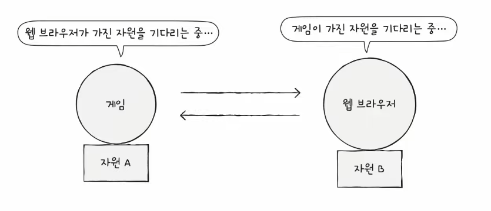

# 데드락

날짜: 2023년 4월 6일
태그: 운영체제

### 1️⃣ 데드락

두 개 이상의 프로세스가 자원을 기다리기만 한다면 진행이 멈추어 버린다.

### 2️⃣ 교착 상태를 해결하기 위해

1. 교착 상태가 발생했을 때의 상황을 정확히 표현해보기
    
    `자원 할당 그래프` 어떤 프로세스가 어떤 자원을 할당 받아 사용하고 있고, 어떤 자원을 기다리고 있는지 나타내는 그래프
    
   
    
2. 교착 상태가 일어나는 근본적인 이유 이해하기
    
    특징 → 원의 형태를 이루고 있다!
    

### `교착 상태가 발생할 조건`

아래 네 가지 조건을 하나라도 만족하지 않으면 `교착 상태`가 발생하지 않고, 네 가지 조건 모두를 만족하면 `교착 상태`가 발생함

- `상호 대기` 한 프로세스가 사용하는 자원을 다른 프로세스가 사용할 수 없는 상태
- `점유와 대기` 자원을 할당 받은 상태에서 다른 자원을 기다리는 상태
- `비선점` 어떤 프로세스보다도 다른 프로세스의 자원을 강제로 빼앗지 못하는 상태
- `원형 대기` 프로세스들이 원의 형태로 자원을 대기하는 상태

### 3️⃣ 교착 상태 해결 방법

1. 예방
2. 회피
3. 검출 후 회복

### 4️⃣ 1. 예방

- 애초에 교착 상태가 발생하지 않도록 `교착 상태 발생 조건` 중 하나를 없애버리기
- 교착 상태가 발생하지 않음은 보장할 수 있으나, 부작용이 따름
1. `상호 배제` : 모든 자원을 공유 가능하게 만들면?
    
    →현실적으로 불가능
    
 
    
2. `점유와 대기 없애기` 특정 프로세스에 자원을 모두 할당하거나 아예 할당하지 않는 식으로 배분하면?
    
    →현실적으로 자원 활용률이 너무 떨어짐
    
3. `비선점 조건 없애기` 
    
    →선점이 가능한 자원(cpu)에 한해 효과적이다. 
    
    → 하지만 모든 자원이 선점 가능한 것은 아니다.
    

1. `원형 대기 조건을 없애기`모든 자원에 번호를 붙이고, 오름차순으로 자원을 할당하면 됨
    
    → 하지만 자원에 번호를 붙이는 것은 어렵고
    
    →어떤 자원에 어떤 번호를 붙이느냐에 따라 활용률이 달라짐
    

### 5️⃣ 2. 회피

한정된 자원을 무분별하게 할당해서 교착 상태가 발생했다고 간주

그래서 교착 상태가 발생하지 않을 만큼 조심 조심 할당함

- `안전 순서열`  교착 상태 없이 안전하게 프로세스들에게 자원을 할당할 수 있는 순서
- `안전 상태` 교착 상태 없이 모든 프로세스가 자원을 할당 받고 종료될 수 있는 상태
- `불완전 상태` 교착 상태가 발생할 수도 있는 상태

📝 예시

> 컴퓨터 시스템에 총 12개의 자원이 있고, 프로세스 P1, P2, P3가 5,2,2개의 자원을 할당받아 실행 중이다
> 

이 때 운영체제가 배분할 수 있는 자원의 수는? → 남은 3개

> 프로세스 P1, P2, P3는 최대 10개, 4개, 9개의 자원을 요구할 수 있다고 가정해 보자
> 

`안전 순서열` 이 존재!  P2 → P1 → P3 

최악의 상황을 가정해 보자. 모든 프로세스가 최대로 자원을 요구한다고 가정해 보자.

그럼 각각 5,2,7개의 자원을 더 요구할 것이다

1. p2에게 남은 3개 중 2개 할당  → 남은 자원은 1개
2. P2 작업 끝내고, 자원 반환 → 남은 자원은 5개
3. P1이 필요한 자원 5개 할당 
4. P1 작업 끝내고 자원 반환 → 남은 자원은 10개
5. P3가 필요한 자원 할당

이렇게 안전 순서열이 만들어 지는 것이다

그럼 다른 상황도 가정해 보자. 만약에 위의 그림에서 운영체제가 P3에게 자원 하나를 더 줬다면?

이 경우 안전 순서열이 없다. 그래서 교착 상태가 발생할 가능성이 있다.

1. p2에 남은 자원 2개 할당
2. p2 작업 끝내고 자원 반환 → 남은 자원은 4개
3. 아무것도 못함

→ 관련 알고리즘 : 은행원 알고리즘

### 6️⃣ 교착 상태 검출 후 회복

교착 상태의 발생을 인정하고 사후에 회복하는 방식

1. 선점을 통한 회복
    1. 교착 상태가 해결될 때까지 한 프로세스씩 자원을 몰아주는 방식
2. 프로세스 강제 종료를 통한 회복
    1. 교착 상태에 놓인 프로세스 모두 강제 종료(작업 내역 잃을 수 있음)
    2. 교착 상태가 해결될 때까지 한 프로세스씩 강제 종료(오버헤드)
    

### 7️⃣+교착 상태 무시

문제 발생의 빈도수가 적기 때문에 그냥 모른 척 하는 방법