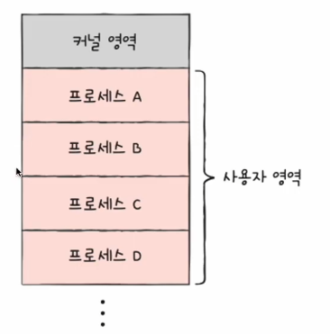

# 페이징&세그먼테이션

날짜: 2023년 4월 13일
태그: 운영체제

> “운영체제는 메모리를 어떻게 관리할까? “
> 

### 1️⃣ 연속 메모리 할당

프로세스에 연속적인 메모리 공간을 할당

### 2️⃣ 스와핑

현재 사용하지 않는 프로세스들을 보조기억장치의 일부 영역으로 쫓아내고 그 공간에 새 프로세스 적재

프로세스들이 요구하는 메모리 공간 크기가 실제 메모리보다 커진다면?

이처럼 안 쓰는 프로세스를 스왑아웃하고, 당장 필요한 프로세스를 적재

### 3️⃣ 메모리 할당

- 프로세스는 메모리의 빈 공간에 할당되어야 한다. 빈 공간이 여러 개 있다면?

- `최초 적합`
    - 빈 공간을 순서대로 검색하다 적재할 수 있는 공간을 발견하면 그 공간에 프로세스 배치
    - A에 적재
- `최적 적합`
    - 빈 공간을 모두 검색해본 뒤 적재 하기 제일 좋은 공간에 적재
    - C에 적재
- `최악 적합`
    - 운영체제가 빈 공간을 모두 검색한 뒤 적재 가능한 가장 큰 공간에 할당
    - B에 적재

### 4️⃣ 연속 메모리 할당의 단점

- `외부 단편화`가 발생
    - 사용자 영역이 200MB일때, 50,30,100,20 MB프로세스를 적재한다고 생각해 보자.
    
   
    
    이 상태에서 남은 공간은 50MB이다. 하지만 이 때 50MB짜리 프로세스를 적재 가능한가?
    
    → 불가능
    

### 5️⃣ 외부 단편화

프로세스들이 실행되고 종료하며 작은 메모리 공간들이 생겨서 메모리가 낭비되는 현상

### 6️⃣ 외부 단편화 해결법

`메모리 압축` 여기저기 흩어져 있는 빈 공간들을 하나로 모으는 방식

프로세스를 재배치시켜 작은 공간을 하나의 큰 빈 공간으로 만드는 방법

→ 프로세스를 옮기는 과정에서 프로세스가 종료되어야 하고, 어떻게 옮기는게 오버헤드가 적을지 알 수 없음

✅ `가상 메모리 기법, 페이징` 

대표적인 메모리 관리법

### 7️⃣가상 메모리

프로세스의 일부만 적재해서 물리 메모리보다 더 큰 프로세스를 실행할 수 있게 해 줌

### 8️⃣ 페이징

프로세스를 일정 크기로 자르고, 이를 메모리에 불연속적으로 할당

→ 프로세스를 이루고 있는 모든 페이지가 적재될 필요는 없다!

= 물리 메모리보다 큰 프로세스도 실행될 수 있다

1. 프로세스의 논리 주소 공간을 `페이지` 라는 일정 단위로 자르고
2. 메모리의 물리 주소 공간을 `프레임` 이라는 페이지와 동일한 일정한 단위로 자른 뒤
3. 페이지를 프레임에 할당함

`스왑 인` 페이지 단위의 스왑 인 (실행에 필요한 페이지들을 메모리로 스왑 인)  

`스왑 아웃` 페이지 단위의 스왑 아웃 ( 메모리에 적재될 필요가 없는 페이지들 스왑 아웃)

### 9️⃣ CPU입장에서는 프로세스 페이지가 어디 저장돼 있는지 어떻게 알까?

불연속적으로 저장된 정보를 cpu가 알기 어렵기 때문에 `페이지 테이블`을 사용한다.

`페이지 테이블`

- 페이지 번호와 프레인 번호를 짝지어 주는 일종의 이정표
- 프로세스마다 페이지 테이블이 있다
    
    
    

⇒ 물리적으로는 분산되어 있더라도 cpu입장에서 바라본 논리 주소는 연속적으로 보임

하지만 `내부 단편화` 야기 가능성 있음

### 🔟 내부 단편화

나머지가 남는 경우는 페이지 크기보다 작은 프로세스가 적재될 수 있음

### 1️⃣1️⃣ 대형 페이지

운영체제에서 일부 허용해 준 대형 페이지

### 1️⃣2️⃣ 페이지 테이블은 어디에 저장되어 있나요?

`PTBR`

- 프로세스마다 페이지 테이블이 있고
- 각 페이지 테이블은 CPU 내의 프로세스 테이블 베이스 레지스터(PTBR)가 가리킨다.

그런데 페이지 테이블이 메모리에 저장되어 있으면 **메모리 접근 시간이 두 배로 걸릴 텐데요**

- 페이지 테이블을 참조하기 위해 한 번
- 그 페이지를 참조하기 위해 한 번

이를 보완하기 위해서 `TLB` 를 사용합니다

`TLB` CPU곁의 페이지 테이블이 캐시 메모리

- 페이지 테이블의 일부를 가져와 저장
    
    `TLB 히트` 현재 접근하려는 논리 주소가 TLB에 있음 → 메모리 접근 한 번
    
    `TLB 미스` 현재 접근하려는 논리 주소가 TLB에 없음 → 메모리 접근 두 번
    

### 1️⃣3️⃣ 페이징에서의 주소 변환

어떻게 논리 주소가 물리 주소로 변환될까요?

1. 어떤 페이지에 접근하고 싶은지에 대한 정보
2. 접근하려는 주소가 그 페이지 혹은 프레임으로부터 얼마나 떨어져 있는지

그래서 페이지 번호와 변위가 페이지 시스템에 저장되어 있다.

그럼 논리 주소상 변위와, 물리 주소상 변위는 같은가?

→ 네. 페이지의 크기와 프레임의 크기는 같으니까요

`페이지 테이블 엔트리` 페이지 테이블의 행(페이지 번호,변위) + `유효 비트` + `보호 비트` + `참조 비트` + `수정 비트`

`유효 비트` 해당 페이지에 접근 가능한지 여부(메모리에 있는지)

`보호 비트` 페이지 접근 권한을 제한하여 페이지 보호(읽기 모드에 쓰기 하며 안됨)

`참조 비트` cpu가 이 페이지에 접근한 적이 있는지 여부

`수정 비트``(더티비트)` cpu가 이 페이지에 데이터를 쓴 적이 있는지 여부

이 페이지가 메모리에 사라질 때 보조 기억 장치에 쓰기 작업을 해야 하는지, 할 필요가 없는지 판단하기 위해 사용(변경되었다면 보조 기억 장치에 반영해야 하니까)

### 1️⃣4️⃣ 페이징

기존에 적재된 불필요한 페이지를 선별해 보조기억장치로 내보내고 프로세스들에게 적절한 수의 프레임을 할당해야 함

### 1️⃣5️⃣ 페이지 폴트

cpu가 사용하고자 하는 페이지가 물리 메모리에 없을 때, 스왑 영역에서 페이지를 찾아 메모리에 로드하는 것

### 1️⃣6️⃣ 요구 페이징

- 처음부터 모든 페이지만을 적재하지 않고 필요한 페이지만을 메모리에 적재
    1. cpu가 특정 페이지에 접근하는 명령어를 실행
    2. 해당 페이지가 현재 메모리에 있을 경우 cpu는 페이지가 적재된 프레임에 접근
    3. 해당 페이지가 현재 메모리에 없을 경우 페이지 폴트가 발생
    4. 페이지 폴트 처리 루틴
        1. 해당 페이지를 메모리로 적재하고 유효 비트를 1로 설정
    5. 다시 1번 수행

### 1️⃣7️⃣ 순수 요구 페이징

1. 아무런 페이지도 메모리에 적재하지 않은 채 일단 실행
2. 페이지 폴트가 발생
3. 어느 순간부터는 페이지 폴트가 발생

### 1️⃣8️⃣ 요구 페이징을 하려면 필요한 것

`페이지 교체` 언젠간 메모리가 페이지로 꽉 차게 된다. 그럼 안 쓰는 걸 보조기억장치로 내보내야 한다

- 페이지 교체 알고리즘

`프레임 교체`

### 1️⃣9️⃣ 페이지 교체 알고리즘

무엇이 좋은 페이지 교체 알고리즘일까?

- 페이지 폴트가 적은 알고리즘!
    - 페이지폴트가 발생하면 보조기억장치에 접근해야 해서 성능 저하
        
        → 그럼 페이지 폴트 횟수를 알아야 한다
        
        `페이지 참조열`
        
        cpu가 참조하는 페이지들 중 연속된 페이지를 생략한 페이지열
        
        : 어차피 연속된 페이지에서는 페이지 폴트가 발생하지 않음
        
1. `FIFO` 
    1. 메모리에 가장 먼저 올라온 페이지부터 올라온 방법
    
    
    
    단점 : 프로그램 실행 초기에 잠깐 실행될 페이지와 프로그램 실행 내내 사용될 페이지를 구분할 수 없다
    
2. `2차 기회 페이지 교체 알고리즘`
    - `FIFO의 보완책`
    
    가장 오랫동안 머무른 페이지를 내쫓지만, 한번 참조한 적이 있는 페이지는 프레임의 제일 끝으로 보낸다.
    
3. `최적 페이지 교체 알고리즘`
    - cpu에 의해 앞으로 참조될 횟수를 고려(가장 오래 사용되지 않을 페이지 교체)
    - 가장 낮은 페이지 폴트율을 보장
    - 하지만 실제 구현이 어렵다. 이걸 어캐 알겠는가
    - 그래서 다른 페이지 교체 알고리즘 성능을 평가하기 위한 하한선으로 간주한다
    
    
    
4. `LRU 교체 알고리즘`
    - cpu에 의해 참조된 횟수를 고려(가장 오래 사용되지 않은 페이지 교체)

### 2️⃣0️⃣ 스레싱과 프레임 할당

페이지 폴트가 자주 발생하는 이유

- 나쁜 페이지 교체 알고리즘을 사용해서
- 프로세스가 사용할 수 있는 프레임 자체가 적어서

`스레싱` 프로세스가 실행되는 시간보다 페이징에 더 많은 시간을 소요하여 성능을 저하시키는 분제

- 동시 실행되는 프로세스의 수를 늘린다고 cpu 이용율이 높아지는 것은 아니다

### 2️⃣1️⃣ 스레싱이 발생하는 이유

- 각 프로세스가 필요로 하는 최소한의 프레임 수가 보장되지 않았기 때문

→ 각 프로세스가 필요로 하는 최소한의 프레임 수를 파악하고, 프로세스들에게 적절한 프레임을 할당해 주어야 한다.

### 2️⃣2️⃣ 프레임 할당

✍🏻 **정적 할당**

1. `균등 할당`
    1. 가장 단순한 할당 방식
    2. 모든 프로세스들에게 균등하게 프레임을 할당하는 방식
    
    단점 : 실행될 프로세스의 크기는 다 다를 텐데 균등하게 할당하는 건 좋지 못함
    
2. `비례 할당`
    1. 프로세스 크기에 비례하여 프레임 할당
    
    단점 : 막상 실행하니까 많은 프레임을 필요로 하지 않을 수 있음
    

🏃🏻**********************동적 할당**********************

1. `작업 집합 모델`
    1. cpu가 특정 시간 동안 주로 참조한 페이지 개수만큼만 프레임을 할당
        
        (참조 지역성 원리처럼, 자주 참조하는 페이지 갯수만큼 자주 참조하게 되어 있음)
        
    
    `작업 집합` 실행 중인 프로세스가 일정 시간 동안 참조한 페이지의 집합
    
    `작업 집합`을 구하려면?
    
    `프로세스가 참조한 페이지`와 `시간 간격`이 필요하다
    
    
    
    
    
2. `페이지 폴트 빈도`
    1. 프로세스가 실행하는 과정에서 배분할 프레임 결정
        1. 가정 1 : 페이지 폴트율이 너무 높으면 그 프로세스는 너무 적은 프레임을 갖고 있다
        2. 가정 1 : 페이지 폴트율이 너무 낮으면 그 프로세스는 너무 많은 프레임을 갖고 있다
            
            
        
        
        
        ⇒ 여기의 **상한선**과 **하한선**에 따라 프레임 할당
        

### 2️⃣3️⃣ 페이징의 이점

- 외부 단편화 해결
- 프로세스간 페이지 공유 (`쓰기 식 복사`)
    
    프로세스는 기본적으로 자원을 공유하지 않기 때문에 부모 프로세스가 적재된 별도의 공간에 자식 프로세스가 통째로 복제되어 적재(`fork`)
    
    를 할 때 동일한 메모리가 중복 적재될 수 있음 
    
    → `쓰기 식 복사`로 해결
    
    - 부모 프로세스와 동일한 자식 프로세스가 복제되어 생성되면 자식 프로세스는 부모 프로세스와 동일한 프레임을 가리킴
    - 만약 부모 프로세스나 자식 프로세스 중 하나가 페이지에 쓰기 작업 수행 시 해당 페이지는 별도의 공간으로 복제
    
    
    

### 2️⃣4️⃣ 계층적 페이징

- 프로세스 테이블의 크기는 생각보다 작지 않다
- 프로세스를 이루는 모든 테이블 엔트리를 메모리에 두는 것은 큰 낭비
- 그래서 페이지 테이블을 페이징하여 여러 단계의 페이지를 둔다
    
    
    
- 모든 페이지 테이블을 항상 메모리에 둘 필요가 없기 때문에 cpu와 가장 가까이 위치한 outer 테이블만 메모리에 위치시킴

### 2️⃣5️⃣ 계층적 페이징의 논리 주소와 물리 주소

계층적 페이징을 이용하는 환경에서의 논리 주소

1. 바깥 페이지 번호를 통해 페이지 테이블의 페이지 찾기
2. 페이지 테이블의 페이지를 통해 프레임 번호를 찾고 변위를 더해서 물리 주소 얻기
    
    
    

물론 계층이 많다고 해서 항상 빠르다는 것은 아니다. 계층이 많으면 메모리를 많이 참조해야 하기 때문이다.

### 2️⃣6️⃣ 세그먼테이션

사용자는 자신의 프로그램을 동일한 크기의 페이지 모음으로 인식하기 보단, 함수는 함수대로, 자료구조는 자료구조대로 각각의 단위 별로 논리적으로 메모리 상에 존재하는 것으로 인식한다

`세그먼트` 

- 논리적 단위가 되는 프로그램 모듈이나 자료구조
- 고유한 이름과 길이를 가짐
- 페이지와 다르게 가변적인 영역

이 `세그먼트` 를 물리 메모리 영역에 반영해주는 기법을 `세그먼테이션` 이라고 한다

### 2️⃣7️⃣ 세그먼트 테이블

각 세그먼트의 시작주소 / 크기 정보 / 세그먼트 한계값

- 페이지처럼 고정적인 크기가 아니라 크기 정보를 저장함

### 2️⃣8️⃣ 세그먼트의 장점

- 같은 프로그램을 사용하고 내부 데이터가 다른 어떤 프로세스 둘이 있다면(워드 프로그램), 이 둘은 세그먼트 테이블 중 일부가 동일해 메모리 상에 하나의 세그먼트만 탑재해 사용할 수 있게 된다.

### 2️⃣9️⃣ 세그먼트 처리

- 페이지는 일정단위로 단순하게 자르면 되지만 세그먼트는 자세한 작업이 필요하다
- 컴파일러가 세그먼트를 구분하여 세그먼트를 식별하고 생성해냄

### 3️⃣0️⃣페이지 세그먼테이션

세그먼테이션 기법을 사용하면 **외부단편화 문제가 다시 발생할 수 있다**. 세그먼트의 크기가 가변적이기 때문이다. 그래서  `페이지 세그먼테이션`을 활용해 이를 해결한다

- `페이지 세그먼테이션` 을 활용하면 세그먼트 테이블과 페이지 테이블 간의 관계 설정이 필요해진다. 세그먼트 테이블 내 항목이 그 세그먼트를 위한 페이지 테이블의 시작 주소를 알려주도록 한다. 이는 `계층적 페이징 기법`과도 유사하다