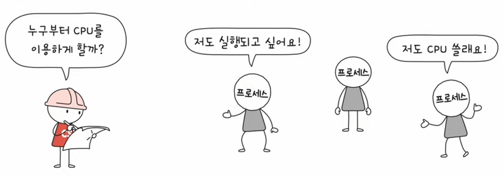

# CPU 스케줄링

날짜: 2023년 4월 6일
태그: 운영체제

### 1️⃣ cpu 스케줄링

운영체제가 프로세스들에게 공정하고 합리적으로 cpu자원을 배분하는 것

### 2️⃣ 가장 공정한 cpu 스케줄링?

1. cpu를 사용하고 싶어하는 프로세스들이 차례대로 돌아가기? → 프로세스마다 우선 순위가 다르기 때문에 적합하지 않음
    1. 입출력 작업이 많은 `I/O 바운드 프로세스`(입출력 집중 프로세스) 의 우선순위는 CPU작업이 많은 `cpu 집중 프로세스`의 우선순위보다 높다.

→ 요구하는 자원에 맡게 cpu 자원을 배분하는 것이 효율적임

### 3️⃣ 프로세스 우선순위

- PCB에 저장됨
    
  
    

### 4️⃣ 스케줄링 큐

- 자원을 쓰고 싶어 하는 프로세스들의 큐(대기줄)

모든 프로세스의 PCB를 뒤적거릴 순 없다. 프로세스가 엄청 많을 테니까. 그래서 `스케줄링 큐` 를 사용한다.

우리가 알고 있는 큐는 FIFO이지만, 스케줄링에서의 큐는 반드시 선입선출 방식일 필요가 없다. 우선순위순으로 처리된다.

1. `준비 큐` cpu를 이용하기 위해 기다리는 줄
2. `대기 큐` 입출력장치를 이용하기 위해 기다리는 줄
    1. 같은 장치르 ㄹ요구한 프로세스들은 같은 큐에서 대기

### 5️⃣ 선점형(*Preemptive*), 비선점형(*Non-**preemptive)* 스케줄링**

이런 상황일 때, 

`선점형` 현재 cpu 사용 중인 프로세스로부터 cpu 자원을 **빼앗아** 다른 프로세스에 할당

- 위의 생성-준비-실행-대기-종료 상태도 선점형 스케줄링이다. 일정 시간이 지나면 cpu 자원을 빼앗아서 다른 프로세스에 할당하니까.

장점 : 어느 한 프로세스의 자원 독점을 막고 골고루 자원을 배분할 수 있다.

단점 : 문맥 교환 과정에서 오버헤드가 발생할 수 있다.

`비선점형` 현재 cpu를 사용 중인 프로세스의 작업이 끝날 때까지 프로세스 **기다리기**

- 프로세스가 종료하거나 대기 상태에 접어들기 전까지 끼어들 수 없음

장점 : 선점형 스케줄링에 비해 문맥 교환에서 발생하는 오버헤드가 작다

단점 : 모든 프로세스가 골고루 자원을 이용하기 어렵다

### 6️⃣ CPU 스케줄링 알고리즘 7가지

1. 선입 선처리 스케줄링(FCFS 스케줄링)
    - 단순히 준비 큐에 삽입된 순서대로 처리하는 비선점 스케줄링
    - 먼저 CPU를 요청한 프로세스로부터 CPU 할당
    
    단점 : 프로세스들이 기다리는 시간이 매우 길어질 수 있음 (=  호위 효과)
    

    
2. 최단 작업 우선 스케줄링(SJF)
    - 호위 효과 방지
    - CPU사용이 긴 프로세스는 나중에 실행하고, CPU사용 시간이 짧은 프로세스는 먼저 실행
    - 선점, 비선점 둘 다로 처리 가능
    
    
    
3. 라운드 로빈 스케줄링(RR)
    - 선입 선처리 + 타임 슬라이스
    
    `타임 슬라이스` 각 프로세스가 cpu를 사용할 수 있는 정해진 시간 → 타이머 인터럽트
    
    타임 슬라이스의 크기가 중요! 너무 작으면 문맥교환이 너무 자주 이루어지고 너무 크면 선입 선처리와 비슷해짐
    
    - 정해진 타임 슬라이스만큼의 시간동안 돌아가며 CPU를 이용하는 선점형 스케줄링
    - 정해진 시간을 모두 사용하였지만 프로세스를 완료하지 못했다면 큐의 맨 뒤에 다시 삽입
    
    
    
4. 최소 잔여 시간 우선 스케줄링(SRT)
    - 최단 작업 우선 스케줄링 + 라운드 로빈
    - 정해진 시간만큼 CPU를 사용하되, 다음으로 CPU를 사용할 프로세스로는 남은 작업 시간이 가장 적은 프로세스 선택
5. 우선순위 스케줄링
    - 프로세스들에 우선순위 부여하고 높은 프로세스부터 실행
    - 우선순위가 같은 프로세스들은 선입 선처리로 스케줄링
    - 최단 작업 우선 스케줄링, 최소 잔여 시간 스케줄링도 우선순위 스케줄링임.
    
    단점 : `기아 현상`
    
    `기아 현상` 우선순위가 낮은 프로세스는 너무 오래 기다리게 됨
    

    
    기아 현상 대비기법 : `에이징`
    
    `에이징` 오랫동안 대시한 프로세스의 우선순위를 점차 높이는 방식
    
6. 다단계 큐 스케줄링
    - 우선순위 스케줄링의 발전된 형태
    - 우선순위별로 준비 큐를 여러 개 사용하는 스케줄링 방식 **(큐별로 스케줄링 기법을 다르게 처리할 수 있음!)**
        - 우선순위가 가장 높은 큐에 비어 있는 프로세스를 먼저 처리
        - 우선순위가 가장 높은 큐가 비어 있으면 다음 우선순위 큐에 있는 프로세스 처리
    
    단점 : 큐 간 이동을 할 수 없어서 `기아 현상` 발생할 가능성 있음
    
 
    
7. 다단계 피드백 큐 스케줄링
    - CPU 스케줄링 방식의 가장 일반적인 형태
    - 다단계 큐 스케줄링의 `기아 현상`을 해결. **큐 간의 이동이 가능함**
    - CPU를 길게 써야 하는 프로세스의 경우 자연스럽게 우선순위가 낮아짐
        1. 새로 준비된 프로세스가 있으면 가장 높은 우선순위 0에 삽입함.
        2. 1이 아직 안 끝났다면 우선순위 1로 넘김
        3. …
    - `에이징` 적용 가능
    
  
    
    ### 7️⃣ 스케줄링 기준
    
    1. `CPU 이용률`(CPU Utiliztion) : 가능한 cpu를 바쁘게 유지하기를 원함
    2. `처리량`(Throughput) : 단위 시간당 완료된 프로세스의 개수
    3. `총처리 시간` (Turnaround Time) : 프로세스를 실행하는 데 소요된 시간
    4. `대기 시간`(Waiting time)  : 대기 큐(ready queue)에서 대기하면서 보낸 시간의 합
    5. `응답 시간`(Response time) : 요청이 제출된 후 첫 번째 응답이 나올 때까지의 시간