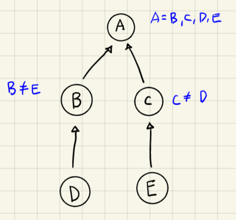
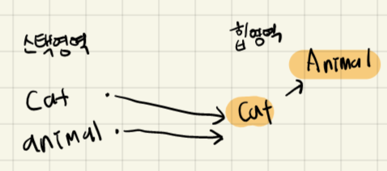
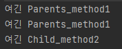
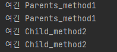

# 다형성

### 1️⃣ 다형성이란?

하나의 타입에 여러 객체를 대입함으로써 다양한 기능을 이용할 수 있게 해 주는 성질

자바의 경우, `자식 클래스의 타입`을 `부모 클래스`로 변환할 수 있다.

즉 **부모 타입 = 모든 자식** 타입 처럼 대입할 수 있다는 것이다.

<aside>
🌟 예를 들어, 자동차를 설계할 때 타이어 클래스 타입을 적용했다면, 타이어를 상속한 무지개타이어, 불타이어 어떤 것이든 장착할 수 있다는 뜻이다

</aside>

### 2️⃣ 타입 변환이란?

데이터 타입을 다른 데이터 타입으로 변환하는 행위를 말한다. 

Tire = 불타이어

처럼 대입이 가능하다.

### 3️⃣자동 타입 변환

<aside>
🌟 부모클래스 변수 = 자식 클래스 타입

</aside>

✅ 위와 같은 조건일 때, 자식 클래스 타입은 부모 클래스 타입으로 자동변환된다.

✅ 또한 바로 위의 부모가 아니더라도 자동 타입 변환은 일어날 수 있다




```java
class Animal{}
```

```java
class Cat extends Animal{}
```

```java
Cat cat = new Cat();
Animal animal = Cat;
Animal animal2 = new Cat();
```

이 메모리 상태를 그림으로 나타내면



이처럼 cat 과 animal 변수는 타입만 다를 뿐, 동일한 Cat 객체를 참조한다.

### 4️⃣ 자동 타입 변환시 메소드는?

부모 타입으로 자동 타입 변환된 후에는 부모 클래스에 선언된 필드와 메소드만 접근이 가능하다. **그러나, 메소드가 자식 클래스에서 오버라이딩 되었다면 자식 클래스의 메소드가 대신 호출된다**

### 5️⃣ 자동 타입 변환은 왜 필요할까?

그냥 자식 타입으로 사용하면 안 되는 걸까? 

다형성이란 동일한 타입을 사용하지만 다양한 결과가 나오는 성질을 말한다. **필드의 타입은 변함이 없지만 실행 도중에 어떤 객체를 필드로 저장하느냐에 따라 실행 결과를 다르게 만들 수 있는 것**이다!

객체 지향 프로그래밍에서 수많은 객체들은 교체될 수 있어야 한다. 이 때의 유지보수를 다형성이 도와주는 것이다. 이를 코드로 이해해 보자

```java
Class Car{
Tire fLTire = new Tire();
Tire fRTire = new Tire();
Tire bLTire = new Tire();
Tire bRTire = new Tire();

void run(){};
}
```

car 클래스는 4개의 Tire 필드를 가지고 있다. 그런데 frTire 와 blTire 를 SnakeTire와 TigerTire로 교체할 필요성이 생겼다. 이 경우 다형성을 사용하여 교체할 수 있다.

```java
Car myCar = new Car();
myCar.frTire = new SnakeTire();
myCar.blTire = new TigerTire();
myCar.run();
```

이렇게 사용하면 자식 타입은 부모 타입으로 자동 타입 변환되므로 문제 없다. Tire 자식 객체는 부모 객체에 필요한 필드와 메서드를 모두 보유하고 있기 때문에  작동이 가능한 것이다.

Car 객체에 run()메소드가 있고, run 메소드는 각 Tire 의 객체에 roll() 메소드를 다음과 같이 호출한다고 가정해 보자

```java
void run(){
	flTire.roll();
	frTire.roll();
	blTire.roll();
	brTire.roll();
}
```

이처럼  frTire 와 blTire를 교체하기 전에는 Tire 객체의 roll() 메서드가 호출되지만, SnakeTire 와 TigerTire 로 교체가 되면 SnakeTire와 TigerTire의 재정의된 roll()메소드를 호출한다. 

**그러면 Car의 run 메소드 수정 없이도 다양한 roll 메서드의 실행 결과를 얻게 되는 것이다**

### 6️⃣ 하나의 배열로 객체 관리

동일한 타입의 값들은 배열로 관리하는 것이 유리하다. 그렇다면, 각기 `다른 객체들을 한 부모의 타입으`로 묶을 수 있지 않을까?

→ 가능하다! 이렇게 클래스를 더 간결하게 수정하면 좋을 것이다.

### 7️⃣ 매개 변수의 다형성

자동 타입 변환은 필드의 값을 대입할 때에도 발생하지만, 주로 메소드를 호출할 때 많이 발생한다. 메소드를 호출할 때에는 매개 변수의 타입과 동일한 매개값을 저장하는 것이 정석이지만, 매개값을 다양화하기 위해 `매개 변수에 자식 타입의 객체를 지정할` 수 도 있다.

자동 타입 변환 덕분에 부모 클래스가 파라미터이면, 자식 객체를 가져다 쓸 수 있는 것이다. 

**그 결과 메소드 내부에서 오버라이딩된 메소드를 호출함으로써 메소드의 실행 결과가 다양해진다!**

### 8️⃣ 강제 타입 변환(Casting)

부모 타입을 자식 타입으로 변환시키는 것을 강제 타입 변환이라고 말한다.

하지만 모든 부모 타입을 자식 타입으로 변환시킬 수 있는 것은 아니다.

```java
자식클래스 변수 = (자식클래스) 부모클래스 타입; 
```

이렇게 변환되면 부모 타입에 선언된 필드와 메소드만 사용 가능하다. 만약 자식 타입에 선언된 필드와 메소드를 꼭 사용해야 한다면 강제 타입 변환을 해서 다시자식 타입으로 변환한 다음 자식 타입의 필드와 메소드를 사용해야 한다. 예제로 살펴보자.

```java
Parent p = new Child();
p.Child만사용가능한메서드() // 불가능

Child c= (Child) p;
c.Child만사용가능한메서드() // 가능
```

```java
public class Main
{
    static class Child extends Parents{
        public static void method2(){
            System.out.println("여긴 Child_method2");
        }
    }

    static class Parents{
        public static void method1(){
            System.out.println("여긴 Parents_method1");
        }
    }
    public static void main(String[] args) {
        Parents p = new Parents();
        p.method1();
        Parents c = new Child();
        c.method1();
       // 🚫c.method2();🚫
        Child cc = new Child();
        cc.method2();
    }
}
```



```java
public class Main
{
    static class Child extends Parents{
        public static void method2(){
            System.out.println("여긴 Child_method2");
        }
    }

    static class Parents{
        public static void method1(){
            System.out.println("여긴 Parents_method1");
        }
    }
    public static void main(String[] args) {
        Parents p = new Parents();
        p.method1();
        Parents c = new Child();
        c.method1();
        Child newC = (Child)c;
        newC.method2();
        Child cc = new Child();
        cc.method2();
    }
}
```



그런데 어떤 객체가 어떤 클래스의 인스턴스인지 확인하는 방법은 없을까? 이 때는 `instanceof` 연산자를 활용하면 된다.

```java
boolean result = 객체 instanceof 타입
```

이 경우 우항의 타입으로 객체가 생성되었다면 true, 그렇지 않다면 false 를 산출한다. 

메소드 내에서 강제 타입 변환이 필요한 경우 반드시 매개값이 어떤 객체인지 instanceof 연산자로 확인하고 안전하게 타입을 변환하자.

```java
if(parent instanceof Child){
	Child child = (Child) parent;
}
```

만약 잘못된 타입에서 강제 타입 변환을 시도한다면 `ClassCastException` 예외가 발생할 수도 있다.

```java
public class Main
{
    static class Child extends Parents{
        public static void method2(){
            System.out.println("여긴 Child_method2");
        }
    }

    static class Parents{
        public static void method1(){
            System.out.println("여긴 Parents_method1");
        }
    }
    public static void main(String[] args) {
        Parents p = new Parents();
        System.out.println(p instanceof Parents); // true
        System.out.println(p instanceof Child); // false

        Parents pc = new Child();
        System.out.println(pc instanceof Parents); // true
        System.out.println(pc instanceof Child); // true

        Child c = new Child();
        System.out.println(c instanceof Parents); // true
        System.out.println(c instanceof Child); // true
    }
}
```