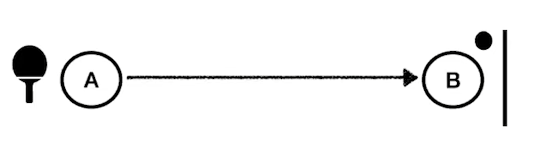

# WebSocket

날짜: 2023년 3월 28일
태그: 너나알아?, 프로젝트

### 1️⃣ 웹소켓은 무엇인가요?

전이중통신을 통해 실시간성을 보장하는 서비스 입니다.

게임, 채팅, 실시간 주식 거래 사이트 등에 사용됩니다.

### 2️⃣ 웹소켓 말고 실시간성을 보장하는 기법은 없나요?

### `polling`

클라이언트가 n초 간격으로 request 를 서버로 계속 날려서 response 를 전달하는 방식

🙆🏻‍♂️ **장점 :** 

- 구현이 쉬움

⛔ **단점 :** 

- 서버에서 보낼 내용이 없어도 request를 계속 보내야 한다
- HTTP는 단발성 통신이기 때문에 header가 무겁다. 이러한 프로토콜을 사용해서 request 를 날리면 버서의 부담이 증가한다 (`http 오버헤드`)
    
    ❓`http 오버헤드` : 헤더 같은 정보 때문에 데이터량이나 처리시간이 늘어남
    
- 초 간격을 늘리면 실시간성이라고 보기 힘들다

### `long polling`

클라이언트의 요청에 대해 응답을 보내지 않고 timeout 이 날 때까지 기다렸다가 이벤트가 발생했을 때 응답을 리턴하는 방식. 클라이언트는 pending 상태로 대기하고 있다가 연결이 끊기면 다시 연결한다

1. 클라이언트에서 서버로 http request를 날린다
2. 서버에 응답 가능한 데이터가 없으면 계속 기다린다 (pending)
3. 서버에서 클라이언트로 전달할 이벤트가 있거나 timeout 되면 순간 response 메세지를 날려서 연결을 종료한다
4. 클라이언트는 곧바로 http request 를 날려서 다음 이벤트를 기다린다

🙆🏻‍♂️ **장점 :** 

- 폴링 방식보다 서버의 부담이 줄어든다

⛔ **단점 :** 

- 데이터의 업데이트가 빈번해진다면 일반 폴링과 큰 차이가 없다
- 여러 명이 동시에 요청을 보내면 급작스러운 요청이 몰리면서 부하가 발생할 수 있다.

### `Streaming`

이벤트가 발생했을 때 응답을 내려주되, 응답을 완료시키지 않고 계속 연결 유지

🙆🏻‍♂️ **장점 :** 

- 응답마다 다시 요청하지 않아도 되므로 롱폴링보다 효율적이지만, 연결 시간이 길어질수록 유효성 관리의 부담이 증가한다.

⛔ **단점 :** 

- http 통신을 하기 때문에 여전히 헤더가 불필요하게 크고, 연결 시간이 길어질수록 연결 유효성 관리의 부담이 발생한다.

### 3️⃣ http 헤더에는 뭐가 들어 있길래 오버헤드가 발생할까?

http 헤더에 뭐가 들어있는지는 길이가 길어져서 생략한다.

### 4️⃣ http 오버헤드란 무조건 안좋은 건가요?

오버헤드가 되었다는 것은, 처리 시간 및 메모리가 추가적으로 사용되는 현상을 의미한다.

> A를 처리하기 위해 3초 걸리는데, 안전성을 위해 B라는 처리를 추가한 결과 처리시간이 10초가 걸렸다고 하자. 이 때 오버헤드는 7초가 되는 것이다.
> 

- 전송중인 데이터에 `추가로 보내지는 정보`이다. 통상 패킷이나 프레임의 선두에 있는 헤더상에 위치하기에 헤더라고도 부른다.
- 원래 정보 전송 기능에는 정보가 보내려는 곳에 제대로 도착했는지 확인하는 기능이 없다. 하지만 추가적인 데이터를 실어서 이를 가능하게 한다.

**그러므로 프로토콜 오버헤드는 정보 전송의 신뢰성을 높일 수 있고, 시스템을 안정적으로 운용할 수 있게 해 준다.**

### 5️⃣ HTTP vs 웹소켓

**HTTP**

- 비연결성
- 매번 연결 맺고 끊는 과정의 비용
    - 3handshake, 4handshake
- 요청-응답 구조




- 매 요청시마다 헤더에 많은 정보 담아서 보냄


**웹소켓**

- 연결지향
- 한번 연결 맺은 뒤 유지
- 양방향 통신


- 적은 정보 담아서 보냄. handshake 를 하는 과정에서는 http 통신과 유사한 양의 정보를 헤더에 담아서 보내지만, 그 이후로는 간단한 문자열만 보냄


### 6️⃣ 웹소켓 지원현황

모든 곳에서 지원하는 것은 아니다.


하지만 웹소켓을 지원하지 않는 곳에서도 웹소켓을 사용하는 것 처럼 만들어주는 라이브러리가 있다

- SockJS
- Socket.io


### 7️⃣ 그럼 스프링에서는 어떻게 웹소켓을 사용하고 있을까요?

```java
import org.springframework.context.annotation.Configuration;
import org.springframework.web.socket.config.annotation.EnableWebSocket;
import org.springframework.web.socket.config.annotation.WebSocketConfigurer;
import org.springframework.web.socket.config.annotation.WebSocketHandlerRegistry;

@Configuration
@EnableWebSocket
public class WebSocketConfig implements WebSocket Configurer {

@Override
public void registerWebSocketHandlers (WebSocketHandlerRegistry registry) {
	registry.addHandler(new SocketTextHandler(), "/user")
		.setAllowedOrigins ("*")
		.withSockJS();
)
)
```

- `socketTextHandler` 직접 구현한 웹소켓 핸들러
- `/user` 웹소켓 연결 주소
- `setAllowedOrigins` 웹소켓도 same Origin 만 사용하는 게 기본 정책이다. 그래서 Cors 설정이 필요하다.
- `withSockJS()` 한 줄을 추가하는 것만으로 sockJS 라이브러리를 사용하게 할 수 있음

```java
WebSocketHandler
package playground.websocket.socket;
import java.util.Set;
import java.util.concurrent.ConcurrentHashMap;
import org.json.JSONObject;
import org.springframework.web.socket.CloseStatus;
import org.springframework.web.socket. TextMessage;
import org.springframework.web.socket.WebSocketSession;
import org.springframework.web.socket.handler. TextWebSocketHandler;

public class SocketTextHandler extends TextWebSocketHandler {

private final Set<WebSocketSession> sessions ConcurrentHashMap.newKeySet();

@Override
public void afterConnectionEstablished (WebSocketSession session) {
	sessions.add(session);
}

@Override
protected void handleTextMessage (WebSocketSession session, TextMessage message) throws Exception {
	String payload message.getPayload();
	JSONObject jsonObject = new JSONObject (payload);
	for (WebSocketSessions sessions) {
	s.sendMessage(new TextMessage( payload: "Hi" + jsonObject.get("user")+"! How may I help you?"));
	}
}
@Override
public void afterConnectionClosed (WebSocketSession session, CloseStatus status) throws Exception {
sessions.remove(session);
}
```

- `TextWebSocketHandler` Spring이 제공하는 기본 클래스. 문자열과 바이너리 타입을 제공하는데 둘 중 사용하기 편한 걸 선택하면 됨
- `WebSocketSession` http세션과는 다름. 웹소켓이 연결될 때 생기는 연결 정보를 담고 있는 객체. 이 세션들을 컬렉션으로 담아서 관리하는 경우가 많음

### 7️⃣ Spring Messaging이란?

SpringBoot 에서 라이브러리를 가져오다 보니까 Spring Messaging이 있는데, 이건 뭐길래 Spring Websocket 에 딸려오는 건가요?

### 8️⃣ STOMP (Simple Text Oriented Messaging Protocol)

- 메시지 브로커를 활용하여 쉽게 메세지를 주고받을 수 있는 프로토콜
    - pub-sub(발행-구독) : 발신자가 메시지를 발행하면 수신자가(구독자) 그 메시지를 받아볼 수 있음
    - 메시지 브로커 : 발신자의 메시지를 받아서 수신자들에게 메시지를 전달하는 어떤 것
- 웹소켓 위에 얹어 함께 사용할 수 있는 서브(하위) 프로토콜

### 9️⃣ 웹소켓만 쓰면 안 되나요? STOMP 안써도 될거같은데?

웹소켓은 텍스트, 바이너리 타입을 주고 받을 수 있죠, 하지만 이를 어떤 형태로 주고받을지는 정해진 게 없습니다. 소규모 프로젝트에서는 대충 통일해서 사용할 수 있겠지만 대형 프로젝트에서는 상대방이 바이너리로 보냈는지, 텍스트를 보냈는지 알 수 없습니다.

이를 확인하려면 또다른 로직을 정의해야겠죠? STOMP는 이를 대신합니다.

STOMP 프레임 프로토콜

- 커맨드
- 헤더
- 바디

웹소켓 vs 웹소켓 + STOMP


Spring 이 STOMP를 사용할 때 동작 흐름


코드로 보는 Spring Websocket + STOMP

```java
Spring - WebSocket MessageBroker
import org.springframework.context.annotation. Configuration;
import org.springframework.messaging.simp.config.MessageBrokerRegistry;
import org.springframework.web.socket.config.annotation. EnableWebSocketMessageBroker;
import org.springframework.web.socket.config.annotation.StompEndpointRegistry;
import org.springframework.web.socket.config.annotation. WebSocketMessageBrokerConfigurer;

@Configuration
@EnableWebSocketMessageBroker
public class WebSocketBrokerConfig implements WebSocketMessageBrokerConfigurer {

@Override
public void configureMessageBroker (MessageBrokerRegistry registry) {
	registry.enableSimpleBroker("/queue", "/topic");
	registry.setApplicationDestination Prefixes ("/app");
}
@Override
public void registerStompEndpoints (StompEndpoint Registry registry) {
	registry.addEndpoint (...paths: "/gs-guide-websocket").withSockJS();
}}
```

`enableSimpleBroker()` Spring에서 사용하는 내장 브로커를 사용. 파라미터는 prefix 가 붙은 메시지를 발행 시 브로커가 처리하겠다는 뜻

컨벤션 `queue` : 1대1

컨벤션 `topic` : 1대 다

`setApplicationDestination` 핸들러로 메시지 라우팅

`registerStompEndpoints` 웹소켓 연결 주소. 이전처럼 핸들러 하나하나 추가할 필요 없다. 하나의 연결 주소마다 핸들러를  사용할 필요 없이, 컨트롤러로 간편하게 처리 가능하기 때문이다

CORS 처리 등도 가능하다. 

```java
Message Handler
import org.springframework.messaging.handler. annotation. MessageMapping;
import org.springframework.messaging.handler.annotation. SendTo;
import
org.springframework.stereotype.Controller;
import org.springframework.web.util.HtmlUtils;

@Controller
public class Greeting Controller {
	@MessageMapping ("/hello")
	@SendTo("/topic/greeting")
	public Greeting greeting (HelloMessage message) throws Exception {
	Thread.sleep( millis: 1000);
	return new Greeting (
	content: "Hello, " + HtmlUtils.htmlEscape (message.getName()) + "!"
}
	
```

`MessageMapping` 요청에 맞는 핸들러에 위임. 여기서는 app/hello~ 라는 주소가 맵핑될 것

`SendTo` 핸들러에서 처리를 마친 반환값을 보낼 경로

STOMP를 사용하는 장점

- 하위 프로토콜 혹은 컨벤션을 정의할 필요 없음
- 연결 주소마다 새로 핸들러를 구현하고 설정해줄 필요가 없음
- 외부 Messaging Queue를 사용할 수 잇음
- SpringSecurity를 사용할 수 있음


### 🔟 웹소켓으로 개발하기 전 알아둬야 할 것들

- SSL/TLS 보안 계층으로 암호화되어야 데이터 탈취를 방지할 수 있다. 이 때 웹소켓 서버와 메인 서버를 분리하고 싶다면 두 서버는 별도의 인증서를 발급받아야 하고, 서로 통신할 수 없기 때문에 프록시 서버나 API를 만들어야 한다.
    
    `프록시 서버` 클라이언트와 서버 사이의 중계 서버
    
- 메인 서버와 웹소켓 간에 통신할 때도 CORS가 발생할 수 있으므로, 프록시 서버를 두거나 추가 API를 만들어야 한다

참고

[https://yozm.wishket.com/magazine/detail/1911/](https://yozm.wishket.com/magazine/detail/1911/)

[https://inpa.tistory.com/608](https://inpa.tistory.com/608)

[https://junhyunny.github.io/information/spring-boot/polling-long-polling-and-spring-example/](https://junhyunny.github.io/information/spring-boot/polling-long-polling-and-spring-example/)

[https://junhyunny.github.io/information/spring-boot/polling-long-polling-and-spring-example/](https://junhyunny.github.io/information/spring-boot/polling-long-polling-and-spring-example/)