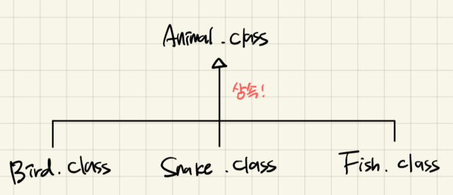

# 추상 클래스

### 1️⃣ 추상 클래스란?

`실체 클래스` 객체를 직접 생성할 수 있는 클래스

`추상 클래스` 실체 클래스의 공통적인 특성을 추출해서 선언한 클래스

1. 실체 클래스는 추상 클래스를 상속한다



1. 추상 클래스는 실제 클래스의 공통되는 필드와 메소드를 추출해서 만든 것이기 때문에 객체를 직접 생성할 수 없다

```java
🚫 Animal animal = new Animal(X)
```

1. 추상 클래스는 extends 뒤에만 올 수 있다

```java
✅ class Ant extends Animals {}
```

### 2️⃣ 추상 클래스의 용도

1. 실체 클래스들의 공통된 필드와 메소드의 이름을 통일
2. 실체 클래스를 작성할 때 시간을 절약

### 3️⃣ 코드로 알아보는 추상 클래스

- 추상 클래스도 일반 클래스와 마찬가지로  필드, 생성자, 메소드 선언을 할 수 있다.
- new 연산자로 직접 생성자를 호출할 수는 없지만 자식 객체가 생성될 때 super 를 호출해서 추상 클래스 객체를 생성하므로 생성자가 반드시 있어야 한다

```java
public class Main
{
    public static abstract class Phone{
        //필드
        public String owner;

        //생성자
    
        //메소드
        public void turnOn(){
            System.out.println("폰 전원을 켭니다.");
        }

        public void turnOf(){
            System.out.println("폰 전원을 끕니다.");
        }
    }

    public static class SmartPhone extends Phone{

    }
}
```

이렇게 하면 생성자를 자동으로 만들어 줘서 에러 안 남, 하지만 생성자를 직접 만든 경우 꼭 super()를 임의로 호출해 줘야 함

```java
public class Main
{
    public static abstract class Phone{
        //필드
        public String owner;

        //생성자
        public Phone(String owner){
            this.owner = owner;
        }

        //메소드
        public void turnOn(){
            System.out.println("폰 전원을 켭니다.");
        }

        public void turnOf(){
            System.out.println("폰 전원을 끕니다.");
        }
    }

    public static class SmartPhone extends Phone{
        
        public SmartPhone(String owner) {
            super(owner);
        }
    }
}
```

그리고 이렇게 사용 가능하다

```java
public static void main(String[] args) {
        SmartPhone smartPhone = new SmartPhone("snake4");
        smartPhone.turnOn();
        Phone phone = new SmartPhone("snake4");
        phone.turnOf();
        //Phone phone = new Phone("snake4");
    }
```

### 4️⃣ 추상 클래스와 그냥 클래스를 extend하는 것에 차이가 있나요?

큰 차이가 없습니다. 단, 추상 클래스에서는 `추상 메소드`를 선언하여 상속을 통해 자식 클래스에서 완성하도록 유도할 수 있습니다.


### 5️⃣ 추상 메소드와 오버라이딩

1. Animal 추상 클래스에서 sound 라는 메소드를 정의했다고 생각해 보자. 
2. 그런데 이 sound 메소드는 자식 객체에서 무조건 재정의 되어야 한다.
3. 하지만 이를 어디에도 명시하지 않으면 개발자가 까먹고 sound 메소드를 적지 않을 수도 있다. 
4. 이 경우 `추상 메소드` 를 사용한다.

```java
public | protected abstract 리턴타입 메소드명(매개변수);
```

**이 경우, 상속한 추상 메서드를 오버라이드 하지 않으면 에러가 발생한다.**

### 코드로 알아보는 추상 메소드

```java
class Main{
    public static void main(String[] args) {
        Dog dog = new Dog();
        Cat cat = new Cat();
        dog.sound();
        cat.sound();

        Animal animal = null;
        animal = dog;
        animal.sound();

        animal = cat;
        animal.sound();

        //다형성
        animalSound(new Dog());
    }
    public static void animalSound(Animal animal){
        animal.sound();
    }
}
```

### 6️⃣ 왜 public 과 Protected 만 사용 가능한가요?

`public` 모든 접근 허용

`protected` 같은 폴더(패키지)에 있고, 상속관계의 객체와 상속관계의 객체들만 허용

`default` 같은 패키지에 있는 객체들만 허용

`private` 현재 객체 내에서만 허용


사실 public, protected, default 까지 사용 가능합니다. 하지만 default 는 다른 패키지의 경우 상속이 불가능하므로 권장되지는 않습니다.

### 😢 근데 defualt 는 어디에 쓰든 오류가 나는데용 ㅠㅠ


왜냐하면 default 는 아무것도 안써야 default 이기 때문입니다. 인터페이스의 디폴트메서드랑은 다른 겁니다.

1. 인터페이스에서 아무것도 안쓰면 public
2. 인터페이스의 접근제한자는 public 밖에 없음
    1. 왜냐하면 인터페이스를 구현하는 구현클래스에서 구현이 필연적이기 때문에 접근이 용이하도록 public 접근제한자를 기본으로 하기 때문. 
3. 인터페이스의 **default** 접근제한자를 사용하면 내부를 구현해 줘야 함
4. 클래스의 디폴트는 **default** 
5. 클래스는 아무것도 안써야 **default** 접근제한자가 됨

### 7️⃣ 추상 클래스는 오버라이딩되지 않나요?

추상 클래스의 메소드, 추상 메소드 둘 다 오버라이딩 가능합니다. 하지만 추상 메소드는 꼭 오버라이딩 해야 합니다.