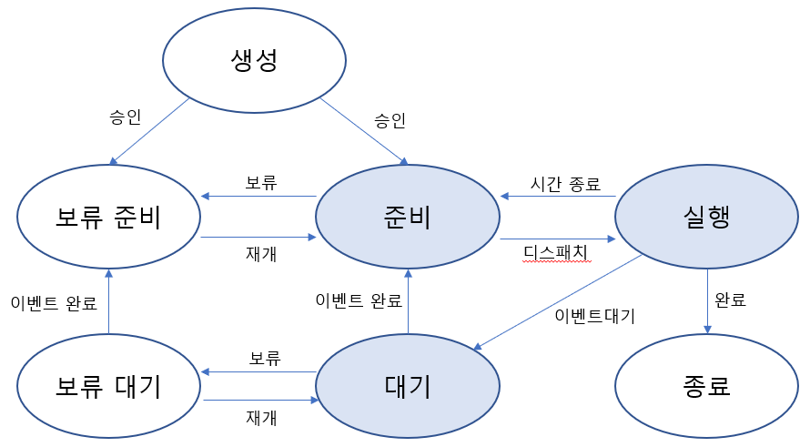

# PCB&Context Switching

날짜: 2023년 3월 27일
태그: 운영체제

### 1️⃣ **Process Management**

cpu프로세스가 여러개일 때, cpu 스케줄링을 통해 관리하는 것

### 2️⃣ Process Metadata

cpu 스케줄링 할 때, 각 프로세스가 뭔지 알아야 관리가 가능하다.. 프로세스들의 특징을 갖고 있는 것이 `process Metadata` 이다.

### 3️⃣ Process Metadata의 구성요소

- Process ID
    - 프로세스 식별자. 운영체제에서 프로세스를 구분하기 위해서 부여받은 번호
    - 프로세스 아이디는 어떻게 부여되나요?
        - 보통 순차적으로 증가하며,  window 에서는 0부터 65535 까지의 범위에서 이를 부여합니다. 윈도우에서는 이를 재사용도 할 수 있습니다.
        - Linux 나 Unix 운영체제에서는 1부터 32768까지 부여합니다. 재사용할 수 없습니다.
- Process State
    - 메모리에 적재된 프로세스 중 cpu에 할당되어 실행되는 것은 하나의 프로세스 뿐이다. 그래서 프로세스는 주기억장치에 적재되어 커널 영역에 PCB를 부여받은 프로그램이다. 그 때 실행을 포함하여 여러 상태 변화를 거치게 된다.
    

    
    **프로세스는 어떤 단계로 실행되나요?**
    
    `준비 상태` `대기 상태` `실행 상태` : 활성 상태(메모리 공간을 일정량 부여받았음을 의미)
    
    1. `생성 상태`
        1. 프로그램이 커널 영역에 **PCB**를 부여받은 상태. 프로세스는 생성되고 보류, 혹은 준비 상태로 가기 때문에 잠시 거쳐가는 상태입니다. 
        2. 운영체제는 프로세스를 생성한 후 주기억장치 공간이 여유로운지 확인하고 공간이 충분하면 프로세스 주소 공간을 할당한 후 프로세스를 `준비 상태`로 바꾸어 줍니다. 공간이 충분하지 않은 경우는 `보류 준비 상태`로 바꾸게 됩니다.
    2. `준비 상태`
        1. 준비 상태는 cpu를 할당받기 위해 기다리고 있는 상태입니다. 준비 상태의 프로세스가 cpu를 할당받게 되면 바로 실행 상태가 됩니다. 다중 프로그래밍에서는 여러 준비상태의 프로세스를 위해 큐, 리스트가 사용됩니다. 운영체제가 준비 상태의 여러 프로세스 중 cpu에 할당하는 순서를 정하는 것을 `**cpu 스케줄링**` 이라고 합니다.
    3. `실행 상태` 
        1. 준비 상태의 프로세스가 cpu를 할당받게 되면**(디스패치)** 실행 상태가 되고, cpu는 해당 프로세스를 실행합니다. 다중 프로그래밍에서 cpu가 1개이면 실행 상태인 프로세스도 당연히 1개만 존재합니다. cpu가 여러 개면 cpu 개수만큼 동시에 프로세스를 처리할 수 있습니다**(다중 처리)**
        2. 실행 상태의 프로세스는 cpu 스케줄링 정책에 의해 cpu를 뺏길 수 있습니다**(선점)**, cpu를 뺏긴 프로세스는 `준비 상태`로 바뀌게 됩니다
        3. 실행 상태인 프로세스가 입출력/read 등이 필요하여 `**System call**` 을 하게 되면 입출력이 종료될 때 까지 `대기 상태` 로 바뀌게 됩니다.
            
            입출력이 완료될 때 까지 실행 상태로 기다리게 되면 비효율적이므로 대기 상태로 바뀌는 것이고, cpu는 준비 상태에 있는 다른 프로세스를 바로 할당받게 됩니다.
            
    4. `대기 상태`
        1. 실행 상태인 프로세스가 입출력을 요청하거나, 바로 확보될 수 없는 자원을 요청하면 cpu를 반납하고 요청할 일이 완료될 때 까지 대기 상태가 됩니다. 이 상태 또한 `준비 상태` 처럼 큐나 리스트로 관리됩니다. 
        2. 요청한 일이 완료되면 대기 상태의 프로세스는 다시 준비 상태로 들어갑니다
    5. `종료 상태` 
        1. 프로세스가 정상적으로 실행이 완료되면 종료 상태가 됩니다. 종료 상태의 프로세스는 모든 자원들이 회수되고 PCB만 커널에 남아 있습니다. 운영체제가 해당 프로세스의 흔적들을 최종적으로 정리한 후 PCB를 삭제하면 프로세스는 완전히 사라지게 됩니다.
    
    `보류 상태` : 메모리를 회수하고 보조기억장치로 내보냄
    
    Swapping
    
    - 주기억 → 보조기억 : Swapped Out
    - 보조기억 → 주기억 : Swapped In
    
    `보류 준비 상태` 생성된 프로세스가 바로 메모리를 받지 못하거나 준비, 실행 상태의 프로세스가 메모리를 잃게 될 때 필요합니다. 주기억장치에 여유가 생기거나, 준비 상태의 프로세스가 전혀 없을 때 대기 상태의 프로세스를 보류 대기 상태로 만듭니다.
    
    `보류 대기 상태` 대기 상태에서 메모리 공간을 잃은 상태. 보류 대기 상태의 프로세스는 입출력이나 기다리던 사건의 종료 시 보류 준비 상태로 바뀌게 됩니다.
    
- Process Priority
    - 프로세스 우선순위.
        - 프로세스 우선순위는 운영체제마다 다를 수 있으며 `시스템 리소스 사용량`, `프로세스의 종류`, `프로세스의 실행 시간`, `프로세스의 요청`, `사용자 우선순위` 등에 따라 결정된다. 이를 기반으로 CPU스케줄링을 수행하게 되는데 우선순위 값이 같은 경우에는 RoundRobin등의 알고리즘 또한 사용된다.
- CPU Registers
    - 해당 프로세스가 cpu를 사용하는 동안 레지스터에 저장하는 데이터
        
        `프로그램 카운터` : 현재 실행 중인 명령어의 주소
        
        `누산기` : 산술 연산 결과 저장
        
        `상태 레지스터` : 프로세스의 현재 상태 저장
        
        `베이스 레지스터` , `인덱스 레지스터` 메모리 주소 계산을 위해 사용 
        
        `스택 포인더` 현재 실행 중인 함수의 스택 프레임을 참조하는 데 사용
        
        `프로세서 모드` cpu가 현재 실행 중인 프로세스의 모드를 나타냄
        
    
    레지스터 : cpu가 요청을 처리하는 데 필요한 데이터를 일시적으로 저장하는 다목적 공간
    
- Owner
    - CPU사용시간 정보와 각종 스케줄러에 필요한 정보를 기억시킴
- etc…

### `PCB` 란?

→ Process Control Block

프로세스 메타데이터들을 저장해 놓는 곳, 한 PCB 안에는 한 프로세스의 정보가 담김

`메타데이터`?

데이터에 관한 구조화된 데이터

`프로세스 메타데이터` ?

cpu는 각 프로세스들이 누군지 알아야 관리가 가능하다. 그 프로세스들의 특징을 갖고 있는 것이 프로세스 메타데이터

### 4️⃣ 프로그램이 실행되는 과정은?

프로그램 실행 → 프로세스 생성 → 프로세스 주소 공간에 코드, 데이터, 스택 생성 → 이 프로세스의 메타데이터들의 PCB에 저장

### 5️⃣ PCB가 왜 필요한가요?

cpu에서는 프로세스의 상태에 따라 교체작업이 이루어집니다. 이 때 앞으로 다시 수행할 대기 중인 프로세스에 관한 저장 값을 PCB에 저장하는 것입니다.

### 6️⃣ PCB는 어떻게 관리되나요?

Linked List 방식으로 관리됩니다. PCB List heap 에 PCB들이 생성될 때마다 붙게 됩니다. 

즉, 프로세스가 생성되면 해당 PCB가 생성되고, 프로세스 완료시 제거됩니다.

### 7️⃣ Context Switching

> CPU가 이전의 프로세스 상태를 PCB에 보관하고, 또 다른 프로세스의 정보를 PCB에서 읽어 레지스터에 적재하는 과정
> 
- 수행 중인 프로세스를 변경할 때, CPU의 레지스터 정보가 변경되는 것을 Context Switching 이라 합니다.
- 인터럽트가 발생하거나, 실행 중인 CPU 사용 허가시간을 모두 소모하거나, 입출력을 위해 대기해야 하는 경우에 Context Switching 이 발생합니다.
    
    `인터럽트` : 예상치 못하거나, 외부에서 발생한 이벤트로 인해 프로세스를 잠시 중단하는 것
    

### 8️⃣ Context Switching OverHead

CPU에 계속 프로세스를 수행시키기 위해서 다른 프로세스를 실행시키고 Context Switching 하는 것. CPU가 놀지 않도록 만들고 사용자에게 빠른 일처리를 제공해 준다.

### 9️⃣ 멀티 프로세스

멀티 프로세스는 context switching 을 통해 프로그램이 동시에 실행되는 것처럼 보이게 하는 것

### 🔟 멀티 쓰레드와 Context Switching 의 관계

Context Switching 이 발생하면 실행되고 있는 code, data, stack, heap 영역을 모두 내리고 새로 실행하고자 하는 프로세스의 code, data, stack, heap 을 다시 불러와야 합니다.

이렇게 하면 자원을 공유하기 때문에 응답시간이 빨라집니다.

### 1️⃣1️⃣ 멀티쓰레드를 사용하면 왜 콘텍스트 스위칭이 빨라지나요?

1. 자원을 공유해봤자 code, data, heap 모두를 cpu에 들고가야 하는거 아닌가요? 비용이 왜 줄어드는지 모르겠어요
    1. 이전에 있던 데이터를 삭제하지 않아도 되기 때문입니다. 그리고 캐시 메모리 초기화도 무거운데, 이 초기화도 안 해도 됩니다.
2. cpu는 한 번에 하나의 프로세스밖에 처리 못하는데 그럼 나눠봤자 cpu는 쓰레드 여러개를 동시에 처리 못하고, 쓰레드 하나밖에 처리 못하는거 아닌가요? 
    1. 쓰레드 컨택스트 스위칭 또한 일어납니다.