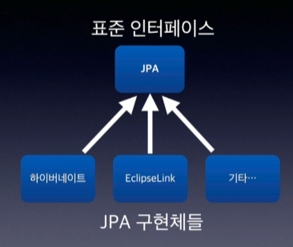

# Spring 핵심원리_1_객체 지향 설계와 스프링

> 객체지향과 스프링을 이해하고 나면 어플리케이션을 설계하는 시야가 달라지고 정말 재미있어집니다.
스프링의 핵심 가치는 `객체 지향` 에 있습니다.
> 

### 📜 강의 목차

1. 객체 지향 설계와 스프링
2. 스프링 핵심 원리이해 - 예제 만들기
3. 스프링 핵심 원리이해 - 객체 지향 원리 적용
4. 스프링 컨테이너와 스플이 빈
5. 싱글톤 컨테이너
6. 컴포넌트 스캔
7. 의존관계 자동 주입
8. 빈 생명주기 콜백
9. 빈 스코프

### 🦜 강의 목표

왜 스프링이 이런 기능을 제공하는지. 기본 기능을 학습하고 본질을 이해하게 됨

객체 지향 설계를 고민하는 개발자로 성장

---

## 자바 진영의 추운 겨울과 스프링의 탄생

정파 기술 EJB : 비쌈, 복잡함 → POJO(옛날 방식)

 → Spring

 → Hibernate → JPA



### 1️⃣ 스프링 생태계

스프링은 여러 기술의 모음이다


`스프링 데이터` CRUD 편리하게 도와줌

`스프링 세션` 세션 기능을 편리하게 도와줌

`스프링 시큐리티` 보안

`스프링 Rest Docs` 문서화 편리하게

`스프링 배치` 대용량 일괄처리의 편의를 위해 설계된 가볍고 포괄적인 배치 프레임워크

`스프링 클라우드` 스프링 특화

[Projects](https://spring.io/projects)

위 링크에 들어가 보면 굉장히 많은 프로젝트가 있음. 이 핵심이 Spring Framework

### 2️⃣ 스프링 프레임워크

1. 핵심 기술 : DI컨테이너, AOP, 이벤트, 기타
2. 웹 기술 : 스프링 MVC, 스프링 WebFlux
3. 데이터 접근 기술 : 트랜잭션, JDBC, ORM 지원, XML 지원
4. 기술 통합 : 캐시, 이메일, 원격접근, 스케줄링
5. 테스트 : 스프링 기반 테스트 지원
6. 언어 : 코틀린, 그루비

### 3️⃣ 스프링 부트

스프링을 편리하게 사용할 수 있도록 지원. 대부분 실무에서 기본으로 사용

### 4️⃣ 스프링 부트의 장점

- 단독으로 실행할 수 있는 스프링 어플리케이션을 쉽게 생성
- 톰캣같은 내장 서버로 별도의 웹 서버를 설치하지 않아도 됨
- 손쉬운 빌드 구성을 위한 starter 종속성 제공
    - 라이브러리를 묶어서 땡겨야 하ㄴ는데 starter 가 다른 것도 자동으로 땡김
- 스프링과 3rd path 라이브러리 자동 구성
    - 외부 라이브러리 버전과 맞지 않을 때 메이저 라이브러리들을 지정해서 다운로드할 수 있게 해 줌
- 메트릭, 상태 확인, 외부 구성 같은 프로덕션 준비 기능 제공
- 관례에 의한 간결한 설정
    - 필요할 때만 커스텀
    

### 5️⃣ 스프링 부트, 스프링

스프링 부트는 스프링 기능들을 편리하게 사용할 수 있는 기능일 뿐. 스프링 프레임워크를 꼭 사용하면서 도와주는 기술

### 6️⃣ “스프링”?

스프링이라는 단어는 문맥에 따라 다르게 사용된다.

- 스프링 DI컨테이너 기술
- 스프링 프레임워크
- 스프링 부트, 스프링 프레임워크 등을 모두 포함한 스프링 생태계

### 7️⃣ 스프링은 왜 만들었을까요?

스프링의 핵심 컨셉은?

- `좋은 객체 지향 어플리케이션`을 개발할 수 있도록 도와주는 프레임워크

## 좋은 객체 지향 프로그래밍이란?

### 1️⃣ 객체 지향 프로그래밍

- 객체들의 모임
- 객체는 메시지를 주고받고, 데이터를 처리할 수 있다
- 객체 지향 프로그래밍은 유연하고 변경이 용이하다

### 2️⃣ 다형성

역할과 구현으로 구분하면 세상이 단순해지고 유연해지며, 변경도 편리해진다.

- 객체 설계시 역할(인터페이스) 를 먼저 부여하고, 그 역할을 후애하는 객체 만들기

### 3️⃣ 객체의 협력이란?

혼자 있는 객체는 없다

### 4️⃣ 다형성의 본질

**클라이언트를 변경하지 않고 실행 시점에 서버를 유연하게 변경할 수 있다**

### 5️⃣ 역할과 구현을 분리하는 것의 한계

인터페이스를 안정적으로 잘 설계해야 큰 변경을 줄일 수 있다

### 6️⃣ 스프링과 객체 지향

- 다형성이 가장 중요하다!
- 스프링은 다형성을 극대화해서 이용할 수 있게 도와준다
- 스프링에서 이야기하는 IoC, DI는 다형성을 활용해서 역할과 구현을 편리하게 다룰 수 있도록 지원한다.
- 스프링을 사용하면 마치 레고 블럭 조립하듯이 구현을 편리하게 변경할 수 있다.

## 좋은 객체 지향 설계의 5가지 원칙

### 1️⃣ SRP(단일 책임의 원칙/Single Response Principle)

- 한 클래스는 하나의 책임만 가져야 한다
- 중요한 기준은 변경이다. 변경이 있을 때 파급 효과가 적으면 단일 책임 원칙을 잘 따른 것
    - UI변경, 객체의 생성과 사용을 분리

### 2️⃣ OCP(개방-폐쇄의 원칙/Open/closed principle)

- 소프트웨어 요소는 확장에는 열려 있으나, 변경에는 닫혀 있어야 한다

```java
public class MemberService{
	private MemberRepository memberRepo = new MemoryMemberRepository();
}
```

⏩

```java
public class MemberService{
	private MemberRepository memberRepo = new JdbcMemberRepository();
}
```

위의 코드를 보면, 다형성을 사용했지만 OCP원칙을 지킬 수 없다

→ 객체를 생성하고 연관관계를 맺어주는 별도의 조립, 설정자가 필요하다

### 3️⃣ LSP(리스코프 치환 원칙/Liskov Substitution Principle)

- 프로그램의 객체는 프로그램의 정확성을 깨트리지 않으면서 하위 타입의 인스턴스로 바꿀 수 있어야 한다.

### 4️⃣ ISP(인터페이스 분리 원칙/Interface Segregation Principle)

- 특정 클라이언트를 위한 인터페이스 여러 개가 범용 인터페이스 하나보다 낫다 (인터페이스가 명확해지고 대체 가능성이 높아진다)

```java
자동차 인터페이스 -> 운전 인터페이스, 정비 인터페이스로 분리
사용자 클라이언트 -> 운전자 클라이언트, 정비사 클라이언트로 분리

✅ 분리하면 정비 인터페이스 자체가 변해도 운전자 클라이언트에 영향을 주지 않음
```

### 5️⃣ DIP(의존관계 역전의 원칙/ Dependency Inversion Principle)

- 역할에 의존해야 한다
- 추상화에 의존해야하지, 구체화에 의존하면 안 된다

```java
public class MemberService{
	private MemberRepository memberRepo = new MemberMemberRepository();
}
```

위 코드를 보면 MemberRepository만 의존한 것이 아니라 MemberMemberRepository까지 의존해 있다.

→ DIP위반

### 6️⃣ 정리

- 객체 지향의 핵심은 다형성
- 다형성 만으로는 쉽게 부품을 갈아 끼우듯이 개발할 수 없다
- 다형성 만으로는 구현 객체를 변경할 때 클라이언트 코드도 같이 변경된다
- 다형성 만으로는 OCP, DIP를 지킬 수 없다
- 뭔가 더 필요하다

## 객체 지향 설계와 스프링

:스프링은 다음 기술로 다형성 + OCP, DIP를 가능하게 지원한다.

- DI(Dependency Injection) : 의존관계, 의존성 주입
- DI 컨테이너 제공

> 옛날 어떤 개발자가 OCP, DIP 원칙을 지키면서 개발을 해보니 너무 할일이 많았다. 그래서 프레임워크(스프링)으로 만들어 버렸다.
> 

⭐ 모든 설계에 역할과 구현을 분리하자

⭐ 자동차, 공연의 예를 떠올려보자

⭐ 배역을 만들고, 배우는 언제든지 유연하게 교체할 수 있도록 하는 것이 좋은 객체 지향 설계다

⭐ 이상적으로는, 모든 설계에 인터페이스를 부여하자

- 하지만 `추상화`라는 비용이 발생한다
    - 개발자가 구현 코드를 한번 더 열어봐야 한다
    - 그러므로, 기능을 확장할 가능성이 없다면 구체 클래스를 직접 사용하고, 향후 꼭 필요할 때 리팩터링해서 인터페이스를 도입하는 것도 방법이다.