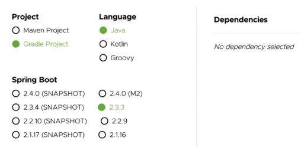

# Spring 핵심원리_2_예제 만들기

날짜: 2023년 5월 14일

### 1️⃣ SpringStarter로 스타터 시작하기

[](https://start.spring.io/)



generate 를 누르면 스타터 패키지가 생성된다.

dependencies 를 아무것도 만들지 않으면 꼭 필요한 것들만 알아서 생성해준다.

- gradle 을 변경하면 코끼리 아이콘을 눌러줘야 한다

<aside>
🌟 인텔리제이 실행 버튼이 눌리지 않을 때
→ [https://velog.io/@ogu1208/Error-프로젝트-세팅-오류](https://velog.io/@ogu1208/Error-%ED%94%84%EB%A1%9C%EC%A0%9D%ED%8A%B8-%EC%84%B8%ED%8C%85-%EC%98%A4%EB%A5%98)

</aside>

<aside>
🌟 Cause: error: invalid source release: 17
→ build.gradle 을 `sourceCompatibility = '11'` 로 수정

</aside>

> `ctrl + alt + s`  : preperences인텔리제이 단축키
> 

> gradle설정을 바꾸면 조금 더 빠르다
> 
> 
> ![Untitled]
> 

### 비즈니스 요구사항과 설계

> 백번 보는 것보다 한번 코드로 쳐 보는게 훨씬 이해가 빠르다
> 

요구사항을 보면, 당장 결정하기 어려운 부분이 존재한다. 하지만 이 정책이 결정될 때까지 개발을 무기한 기다릴 수 없다. 이 때 `객체 지향 설계 방법` 을 사용하면 된다.


- 미확정되어 있더라도, 인터페이스로 구현하면 된다
- 현재는 순수한 자바로만 개발을 진행한다(Spring 관련 코드 없음)


> `Alt + Insert` : 생성자 단축키
> 

> `Ctrl + Shift + Enter` = new 뒤쪽 자동완성
> 

> `Ctrl + Alt + V` = 오른쪽 자동완성
> 

<aside>
🌟 `MemberService memberService = new MemberServiceImpl();`
에서, 왜 MemberServiceImple()을 넣을까? MemberService 를 넣으면 안 되는 걸까?

→일단, 앞의 친구들이 인터페이스고 Impl이 구현체이다.
다형성을 활용하기위해서 이렇게 쓰는 것이다

</aside>

<aside>
🌟 `assertThat`이 `Cannot resolve method 'assertThat' in 'Assertions’` 라고 뜰 때

→ import 를 잘못 한 것이다. 제대로 import 해 주자

</aside>

### 회원 도메인 설계의 문제점

- 아래 코드는 다른 저장소로 변경할 때 OCP원칙을 잘 준수할까요?
- DIP를 잘 지키고 있을까요?
- ⌨️ 코드
    
    ```java
    package hello.core.member;
    
    public enum Grade {
        BASIC,
        VIP
    }
    ```
    
    ```java
    package hello.core.member;
    
    public class Member {
    
        private Long id;
        private String name;
        private Grade grade;
    
        public Member(Long id, String name, Grade grade) {
            this.id = id;
            this.name = name;
            this.grade = grade;
        }
    
        public Long getId() {
            return id;
        }
    
        public void setId(Long id) {
            this.id = id;
        }
    
        public String getName() {
            return name;
        }
    
        public void setName(String name) {
            this.name = name;
        }
    
        public Grade getGrade() {
            return grade;
        }
    
        public void setGrade(Grade grade) {
            this.grade = grade;
        }
    }
    ```
    
    ```java
    package hello.core.member;
    
    public interface MemberRepository {
    
        void save(Member member);
    
        Member findById(Long memberId);
    }
    ```
    
    ```java
    package hello.core.member;
    
    public class MemberServiceImpl implements MemberService{
    
        private final MemberRepository memberRepository = new MeMoryMemberRepository();
        @Override
        public void join(Member member) {
            memberRepository.save(member);
        }
    
        @Override
        public Member findMember(Long memberId) {
            return memberRepository.findById(memberId);
        }
    }
    ```
    
    ☝🏻 **여기서, 실제 할당하는 부분이 구현체를 의존하고 있기 때문에 DIP를 위반하고 있다**
    
    ```java
    package hello.core.member;
    
    import java.util.HashMap;
    import java.util.Map;
    
    public class MeMoryMemberRepository implements MemberRepository{
        //사실은 동시성 이슈 때문에 ConcurrnetHashMap를 쓰는게 맞음
        private static Map<Long, Member> store= new HashMap<>();
    
        @Override
        public void save(Member member) {
            store.put(member.getId(), member);
        }
    
        @Override
        public Member findById(Long memberId) {
            return store.get(memberId);
        }
    }
    ```
    

### 주문과 할인 도메인 설계


`역할과 구현을 분리` 해서 자유롭게 구현 객체를 조립할 수 있게 설계했다. 할인 정책을 유연하게 바꿀 수 있다.


<aside>
🌟 DTO 의 멤버 접근제한자를 private 쓰는 이유
→ 클래스 내에서만 접근가능하도록 하기 위해서

</aside>

- 코드
    
    ```java
    package hello.core.order;
    
    public class Order {
        private Long memberId;
        private String itemName;
        private int itemPrice;
        private int discountPrice;
    
        public Order(Long memberId, String itemName, int itemPrive, int discountPrice) {
            this.memberId = memberId;
            this.itemName = itemName;
            this.itemPrice = itemPrive;
            this.discountPrice = discountPrice;
        }
    
        public int calculatePrice(){
            return itemPrice - discountPrice;
        }
    
        public Long getMemberId() {
            return memberId;
        }
    
        public void setMemberId(Long memberId) {
            this.memberId = memberId;
        }
    
        public String getItemName() {
            return itemName;
        }
    
        public void setItemName(String itemName) {
            this.itemName = itemName;
        }
    
        public int getItemPrice() {
            return itemPrice;
        }
    
        public void setItemPrice(int itemPrice) {
            this.itemPrice = itemPrice;
        }
    
        public int getDiscountPrice() {
            return discountPrice;
        }
    
        public void setDiscountPrice(int discountPrice) {
            this.discountPrice = discountPrice;
        }
    
        @Override
        public String toString() {
            return "Order{" +
                    "memberId=" + memberId +
                    ", itemName='" + itemName + '\'' +
                    ", itemPrice=" + itemPrice +
                    ", discountPrice=" + discountPrice +
                    '}';
        }
    }
    ```
    
    ```java
    package hello.core.order;
    
    public interface OrderService {
        Order createOrder(Long memberId, String itemName, int itemPrice);
    
    }
    ```
    
    ```java
    package hello.core.order;
    
    import hello.core.discount.DiscountPolicy;
    import hello.core.discount.FixDiscountPolicy;
    import hello.core.member.MeMoryMemberRepository;
    import hello.core.member.Member;
    import hello.core.member.MemberRepository;
    
    public class OrderServiceImpl implements OrderService{
    
        private final MemberRepository memberRepository = new MeMoryMemberRepository();
        private final DiscountPolicy discountPolicy = new FixDiscountPolicy();
    
        @Override
        public Order createOrder(Long memberId, String itemName, int itemPrice) {
            Member member = memberRepository.findById(memberId);
            int disCountPrice = discountPolicy.discount(member,itemPrice);
    
            return new Order(memberId, itemName, itemPrice, disCountPrice);
        }
    }
    ```