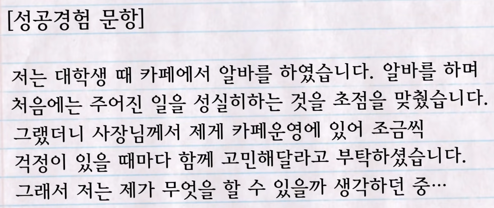

# 자소서 잘 적는법

날짜: 2023년 4월 16일

[면접관이 5초만 봐도 합격시키고 싶은 자소서 작성법 3가지](https://www.youtube.com/watch?v=eGv5EAMF8OQ&t=183s)

### 1️⃣ 기본이 되는 자소서 작성법 3가지

1. 상대가 듣고 싶은 말만 작성하기
    - 나의 스토리, 자서전 x
2. 면접관이 알고 싶은것은 `Result`(경험의 결과) + `How` (어떻게 결과를 얻었나)
    
    
    
3. 두괄식
4. 열심과 열정을 단어로 강조하려고 하지 않기
    - 면접관은 이를 검증할 수 없다
    - 두괄식으로 결과를 먼저 적을 것
    - 수치화로 열정과 노력을 대변할것
5. 근거없는 자소서는 진부한 자소서
6. **Why 을 5번 묻기**
    1. 내가 이 경험을 통해 어떤 결과를 얻었나
    2. 왜 아무 결과도 못얻었나
    3. 진짜 아무 결과도 못 얻었던게 맞나
    4. 사소한 결과라도 어떻게 내가 얻을 수 있었나
    5. 내가 한 행동들 중에 가장 고객을 만족시켰던 행동이 무엇인가
    

### 2️⃣ 지원 동기

[면접관이 싹 정리해주는 뽑아쓰면되는 지원동기 5가지](https://www.youtube.com/watch?v=blGokSb2vso)

1. 지역적 특성 (지역의 고객 이해)
    1. ~지역과 관련해서 전문성이 있다
    2. ~ 에서 살아보았다
    3. A회사는 ~ 지역의 ~ 영역에서 사업을 확장~
    
    → 단기로 다녀온 경우는 Reasonable 하지 않음. 사업이나 알바라도 했어야 함
    
2. **기술적 특성** 
    1. 지원하는 회사만이 가지고 있는 기술의 경쟁우위
    2. 경쟁사에는 없는데 이 회사에만 있는 것
    3. 내가 지원하는 분야에서 가장 앞선 기술력이 있는 회사라면 그 포인트에서 전문가가 되기 위해 지원
3. 고객에 대한 이해가 얼마나 높은가 (고객의 어려움을 얼마나 이해하고 있는가)
    1. 이 사람들의 어려움은 ~ 인데, 이런 어려움을 ~ 하게 해결해주고 싶어서
        1. 유사직무, 회사경험
4. 상품과 서비스의 매력도 설명이 가능한가
    1. 다 써봤는데 이 회사만의 매력
        1. 이 회사만이 가지고 있는 OO제품, OO서비스가 저를 감동시켰습니다
        2. 더 많은 사람들이 사용할 수 있도록 도전해보고 싶습니다
    
    → 경쟁사와 비교 필수
    
    → 충성고객으로만 보이면 안됨. 시장전문가로 상품의 매력도를 ~ 강점이 있습니다. ~하게 좋습니다로 표현
    
    - 우리회사만의 경쟁력을 알아주는 것
5. 직무특수성 (회사만이 가지고 있는 문화)
    
    → 현직자 인터뷰, 알바
    
    1. 제가 지원하는 회사의 일하는 방식을 보니까 독특했습니다. 
    2. OO회사는 일하는 방식이 고객만족에 최우선한 독특한 시스템을 갖추고 있었습니다

### 합격 자소서의 특징 ⭐⭐⭐

1. 필살기
    
    유사경험 - 성공경험 - 인사이트
    
2. 구체적인 경쟁력 + 본인이 할 수 있는 기여 = 조직과정에서의 성장
